# DAPO：大规模开源 LLM 强化学习系统

**英文原题：** DAPO: An Open-Source LLM Reinforcement Learning System at Scale  
**版本：** arXiv:2503.14476v2（2025 年 5 月 20 日修订）  
**原文链接：** <https://arxiv.org/abs/2503.14476>  
**项目主页：** <https://dapo-sia.github.io/>  
**verl 代码仓库：** <https://github.com/volcengine/verl>  
**论文日期：** 2025 年 3 月 17 日  
**通讯邮箱：** zhouhao@air.tsinghua.edu.cn；wangmingxuan.89@bytedance.com

**作者：** Qiying Yu，Zheng Zhang，Ruofei Zhu，Yufeng Yuan，Xiaochen Zuo，Yu Yue，Weinan Dai，Tiantian Fan，Gaohong Liu，Lingjun Liu，Xin Liu，Haibin Lin，Zhiqi Lin，Bole Ma，Guangming Sheng，Yuxuan Tong，Chi Zhang，Mofan Zhang，Wang Zhang，Hang Zhu，Jinhua Zhu，Jiaze Chen，Jiangjie Chen，Chengyi Wang，Hongli Yu，Yuxuan Song，Xiangpeng Wei，Hao Zhou，Jingjing Liu，Wei-Ying Ma，Ya-Qin Zhang，Lin Yan，Mu Qiao，Yonghui Wu，Mingxuan Wang。

> **翻译说明**：数学公式、变量、编号、数据和原文省略号均保持不变。原文中出现的疑似笔误或表述歧义以“译注”标出，不对原文内容作纠正。作者名单按 arXiv 页面列出，贡献分工按论文 LaTeX 源文件列出。

## 摘要

推理时扩展（inference scaling）赋予大语言模型（LLM）前所未有的推理能力，而强化学习是激发复杂推理能力的核心技术。然而，当前最先进推理 LLM 的关键技术细节被隐藏起来（例如 OpenAI o1 博客和 DeepSeek R1 技术报告），因此社区仍难以复现其强化学习训练结果。

我们提出**解耦裁剪与动态采样策略优化**（**D**ecoupled Clip and **D**ynamic s**A**mpling **P**olicy **O**ptimization，**DAPO**）算法，并完全开源一个大规模、达到当前最佳水平的强化学习系统：使用 Qwen2.5-32B 基础模型，在 AIME 2024 上取得 50 分。不同于以往隐去训练细节的工作，我们介绍了使大规模 LLM 强化学习成功的四项关键技术。此外，我们开源了构建于 **verl** 框架之上的训练代码，以及经过精心筛选和处理的数据集。这些开源系统组件提升了可复现性，并支持未来的大规模 LLM 强化学习研究。

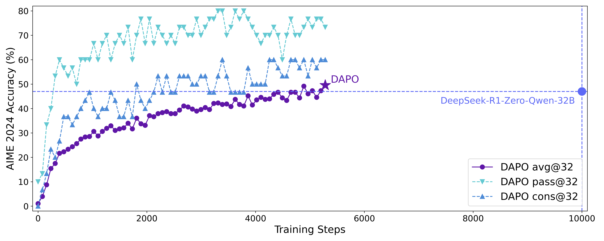

**图 1：** DAPO 在 Qwen2.5-32B 基础模型上的 AIME 2024 分数。使用 50% 的训练步数，超过此前的最佳结果 DeepSeek-R1-Zero-Qwen-32B。横轴表示梯度更新步数。

## 1 引言

OpenAI 的 o1 和 DeepSeek 的 R1 等推理时扩展技术，为大语言模型（LLM）带来了深刻的范式转变。推理时扩展支持更长的思维链（Chain-of-Thought，CoT）思考，并诱导出复杂的推理行为，使模型在 AIME、Codeforces 等竞赛数学和编程任务上表现优异。

推动这场变革的核心技术是大规模强化学习（RL），它能够诱导自我验证、迭代改进等复杂推理行为。然而，可扩展强化学习训练的实际算法和关键配方仍是一个谜，隐藏在现有推理模型的技术报告中。在本文中，我们揭示大规模强化学习训练中的重要障碍，并开源一个可扩展的强化学习系统：算法、训练代码和数据集全部开源，为获得工业级强化学习结果提供民主化的解决方案。

我们以 Qwen2.5-32B 作为强化学习的预训练模型。在最初的 GRPO 运行中，我们在 AIME 上仅取得 30 分，显著低于 DeepSeek 强化学习的 47 分。深入分析发现，朴素 GRPO 基线存在熵坍塌、奖励噪声和训练不稳定等关键问题。更广泛的社区在复现 DeepSeek 结果时也遇到了类似挑战，这表明 R1 论文可能遗漏了构建工业级、大规模且可复现强化学习系统所需的关键训练细节。

为弥合这一差距，我们发布一个用于大规模 LLM 强化学习的开源、当前最佳水平系统。该系统基于 Qwen2.5-32B，在 AIME 2024 上取得 50 分，超过 DeepSeek-R1-Zero-Qwen-32B 的此前最佳结果（47 分），且只使用了 50% 的训练步数（见图 1）。我们提出**解耦裁剪与动态采样策略优化（DAPO）**算法，并引入四项关键技术，使长 CoT 强化学习场景中的 RL 真正发挥作用。具体细节见第 3 节。

1. **Clip-Higher**：促进系统多样性，避免熵坍塌；
2. **动态采样（Dynamic Sampling）**：提升训练效率和稳定性；
3. **Token-Level Policy Gradient Loss**：在长 CoT 强化学习场景中至关重要；
4. **超长奖励塑形（Overlong Reward Shaping）**：减少奖励噪声，稳定训练。

我们的实现基于 verl。通过完整发布包括训练代码和数据在内的当前最佳水平强化学习系统，我们希望揭示对大规模 LLM 强化学习有价值的洞见，使更广泛的社区受益。

## 2 预备知识

### 2.1 近端策略优化（PPO）

PPO 引入了用于策略优化的裁剪代理目标。通过使用裁剪将策略更新限制在旧策略的近端区域内，PPO 可以稳定训练并提高样本效率。具体而言，PPO 通过最大化以下目标来更新策略：

$$
\mathcal{J}_{\text{PPO}}(\theta)=\mathbb{E}_{(q,a)\sim\mathcal{D},o_{\leq t}\sim\pi_{\theta_{\text{old}}}(\cdot\mid q)}\Bigg[\min\Bigg(\frac{\pi_{\theta}(o_{t}\mid q,o_{<t})}{\pi_{\theta_{\text{old}}}(o_{t}\mid q,o_{<t})}\hat{A}_{t},\ \text{clip}\Bigg(\frac{\pi_{\theta}(o_{t}\mid q,o_{<t})}{\pi_{\theta_{\text{old}}}(o_{t}\mid q,o_{<t})},1-\varepsilon,1+\varepsilon\Bigg)\hat{A}_{t}\Bigg)\Bigg],
\tag{1}
$$

其中，$(q,a)$ 是数据分布 $\mathcal{D}$ 中的问题-答案对，$\varepsilon$ 是重要性采样比率的裁剪范围，$\hat{A}_{t}$ 是时间步 $t$ 的优势估计量。给定价值函数 $V$ 和奖励函数 $R$，$\hat{A}_{t}$ 使用广义优势估计（Generalized Advantage Estimation，GAE）计算：

$$
\hat{A}_{t}^{\text{GAE}(\gamma,\lambda)}=\sum_{l=0}^{\infty}(\gamma\lambda)^{l}\delta_{t+l},
\tag{2}
$$

其中

$$
\delta_{l}=R_{l}+\gamma V(s_{l+1})-V(s_{l}),\quad 0\leq\gamma,\lambda\leq 1.
\tag{3}
$$

### 2.2 群组相对策略优化（GRPO）

与 PPO 相比，GRPO 消除了价值函数，以群组相对的方式估计优势。对于特定的问题-答案对 $(q,a)$，行为策略 $\pi_{\theta_{\text{old}}}$ 采样由 $G$ 个独立响应组成的群组 $\{o_i\}_{i=1}^{G}$。随后，通过对群组级奖励 $\{R_i\}_{i=1}^{G}$ 进行归一化，计算第 $i$ 个响应的优势：

$$
\hat{A}_{i,t}=\frac{r_i-\text{mean}(\{R_i\}_{i=1}^{G})}{\text{std}(\{R_i\}_{i=1}^{G})}.
\tag{4}
$$

与 PPO 类似，GRPO 采用裁剪目标，并直接加入 KL 惩罚项：

$$
\begin{aligned}
\mathcal{J}_{\text{GRPO}}(\theta)&=\mathbb{E}_{(q,a)\sim\mathcal{D},\{o_i\}_{i=1}^{G}\sim\pi_{\theta_{\text{old}}}(\cdot\mid q)}\\
&\quad\Bigg[\frac{1}{G}\sum_{i=1}^{G}\frac{1}{|o_i|}\sum_{t=1}^{|o_i|}\Bigg(\min\Big(r_{i,t}(\theta)\hat{A}_{i,t},\ \text{clip}\big(r_{i,t}(\theta),1-\varepsilon,1+\varepsilon\big)\hat{A}_{i,t}\Big)-\beta D_{\text{KL}}(\pi_{\theta}\|\pi_{\text{ref}})\Bigg)\Bigg],
\end{aligned}
\tag{5}
$$

其中

$$
r_{i,t}(\theta)=\frac{\pi_{\theta}(o_{i,t}\mid q,o_{i,<t})}{\pi_{\theta_{\text{old}}}(o_{i,t}\mid q,o_{i,<t})}.
\tag{6}
$$

还需要注意，GRPO 在样本级别计算目标。确切地说，GRPO 首先计算每个生成序列内部的平均损失，再对不同样本的损失取平均。正如第 3.3 节将要讨论的，这种差异可能会影响算法性能。

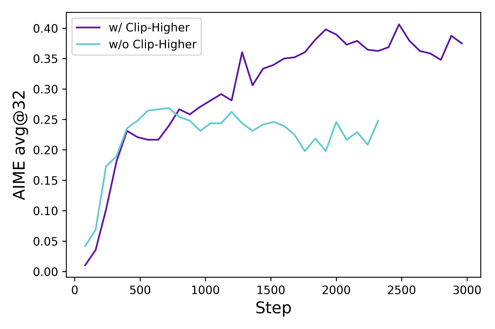

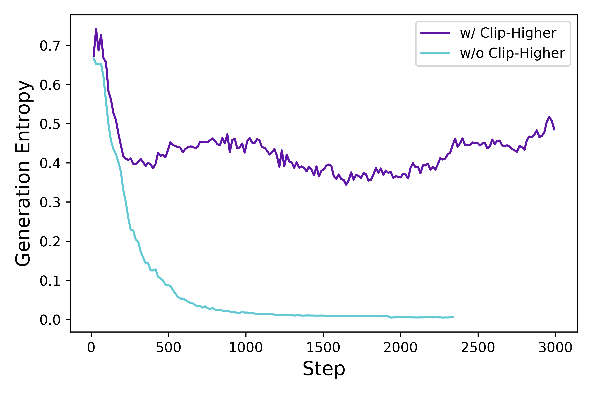

**图 2：** RL 训练过程中，Actor 模型生成概率的熵以及 AIME 测试集上的准确率；分别展示应用 Clip-Higher 策略前后的结果。

### 2.3 移除 KL 散度

KL 惩罚项用于约束在线策略与冻结参考策略之间的差异。在 RLHF 场景中，RL 的目标是在不偏离初始模型过远的情况下对齐模型行为。然而，在训练长 CoT 推理模型时，模型分布可能显著偏离初始模型，因此不需要这一限制。因此，我们将从所提出的算法中排除 KL 项。

### 2.4 基于规则的奖励建模

使用奖励模型通常会遭遇奖励劫持（reward hacking）问题。相反，我们直接使用可验证任务的最终准确率作为结果奖励，并按以下规则计算：

$$
R(\hat{y},y)=
\begin{cases}
1,&\texttt{is\_equivalent}(\hat{y},y)\\
-1,&\text{otherwise}
\end{cases}
\tag{7}
$$

其中，$y$ 是真实答案，$\hat{y}$ 是预测答案。多个领域的研究已经证明，这是激活基础模型推理能力的有效方法，包括自动定理证明、计算机编程和数学竞赛。

## 3 DAPO

我们提出**解耦裁剪与动态采样策略优化（DAPO）**算法。DAPO 对每个与答案 $a$ 配对的问题 $q$ 采样一组输出 $\{o_i\}_{i=1}^{G}$，并通过以下目标优化策略：

$$
\begin{aligned}
\mathcal{J}_{\text{DAPO}}(\theta)=\quad&\mathbb{E}_{(q,a)\sim\mathcal{D},\{o_i\}_{i=1}^{G}\sim\pi_{\theta_{\text{old}}}(\cdot\mid q)}\\
&\Bigg[\frac{1}{\sum_{i=1}^{G}|o_i|}\sum_{i=1}^{G}\sum_{t=1}^{|o_i|}\min\Big(r_{i,t}(\theta)\hat{A}_{i,t},\ \text{clip}\big(r_{i,t}(\theta),1-\varepsilon_{\text{low}},1+\varepsilon_{\text{high}}\big)\hat{A}_{i,t}\Big)\Bigg]\\
\text{s.t.}\quad&0<\Big|\{o_i\mid\texttt{is\_equivalent}(a,o_i)\}\Big|<G,
\end{aligned}
\tag{8}
$$

其中

$$
r_{i,t}(\theta)=\frac{\pi_{\theta}(o_{i,t}\mid q,o_{i,<t})}{\pi_{\theta_{\text{old}}}(o_{i,t}\mid q,o_{i,<t})},\quad
\hat{A}_{i,t}=\frac{R_i-\text{mean}(\{R_i\}_{i=1}^{G})}{\text{std}(\{R_i\}_{i=1}^{G})}.
\tag{9}
$$

完整算法见算法 1。本节将介绍与 DAPO 相关的关键技术。

### 3.1 提高上限：Clip-Higher

在使用朴素 PPO 或 GRPO 的初始实验中，我们观察到熵坍塌现象：随着训练推进，策略熵迅速下降（图 2(b)）。某些群组采样出的响应趋于几乎完全相同。这表明探索受限且策略过早确定化，可能阻碍扩展过程。

我们提出 Clip-Higher 策略来解决这一问题。在裁剪近端策略优化（PPO-Clip）中，对重要性采样比率进行裁剪，以限制信赖域并提高 RL 稳定性。我们发现，上界裁剪会限制策略探索：提高“利用型”token 的概率相对容易，而低概率“探索型”token 的概率提升受到过于严格的限制。

具体而言，当 $\varepsilon=0.2$（多数算法的默认值）且 $\hat{A}_{i,t}>0$（系统试图提高概率）时，考虑两个动作，其概率分别为 $\pi_{\theta_{\text{old}}}(o_i\mid q)=0.01$ 和 $0.9$。增加后的概率 $\pi_{\theta}(o_i\mid q)$ 的上界分别为 $0.012$ 和 $1.08$，即 $\pi_{\theta_{\text{old}}}\cdot(1+\epsilon)$。

这意味着，概率较高的“利用型”token（例如 0.9）不会被限制在只能获得极小的概率增幅（如增加到 0.999 仍不受此上界约束）。相反，对于低概率的“探索型”token，要实现非平凡的概率增加则困难得多。通过经验观察，我们还发现，被上裁剪的 token 的平均概率较低：$\pi_{\theta}(o_i\mid q)<0.2$（图 3(a)）。这一发现支持我们的直觉：上界裁剪阈值确实限制了低概率“探索型”token 的概率增加，从而可能约束系统探索。

遵循 Clip-Higher 策略，我们将较低和较高的裁剪范围解耦为 $\varepsilon_{\text{low}}$ 和 $\varepsilon_{\text{high}}$，如公式（10）所示：

$$
\begin{aligned}
\mathcal{J}_{\text{DAPO}}(\theta)=\quad&\mathbb{E}_{(q,a)\sim\mathcal{D},\{o_i\}_{i=1}^{G}\sim\pi_{\theta_{\text{old}}}(\cdot\mid q)}\\
&\Bigg[\frac{1}{\sum_{i=1}^{G}|o_i|}\sum_{i=1}^{G}\sum_{t=1}^{|o_i|}\min\Big(r_{i,t}(\theta)\hat{A}_{i,t},\ \text{clip}\big(r_{i,t}(\theta),1-\varepsilon_{\text{low}},1+\varepsilon_{\text{high}}\big)\hat{A}_{i,t}\Big)\Bigg]\\
\text{s.t.}\quad&0<\Big|\{o_i\mid\texttt{is\_equivalent}(a,o_i)\}\Big|<G.
\end{aligned}
\tag{10}
$$

我们增大 $\varepsilon_{\text{high}}$ 的值，为低概率 token 的概率提升留出更多空间。如图 2 所示，这一调整有效提高了策略熵，并促进生成更多样化的样本。我们保持 $\varepsilon_{\text{low}}$ 不变，因为增大它会将这些 token 的概率压制到 0，导致采样空间坍塌。

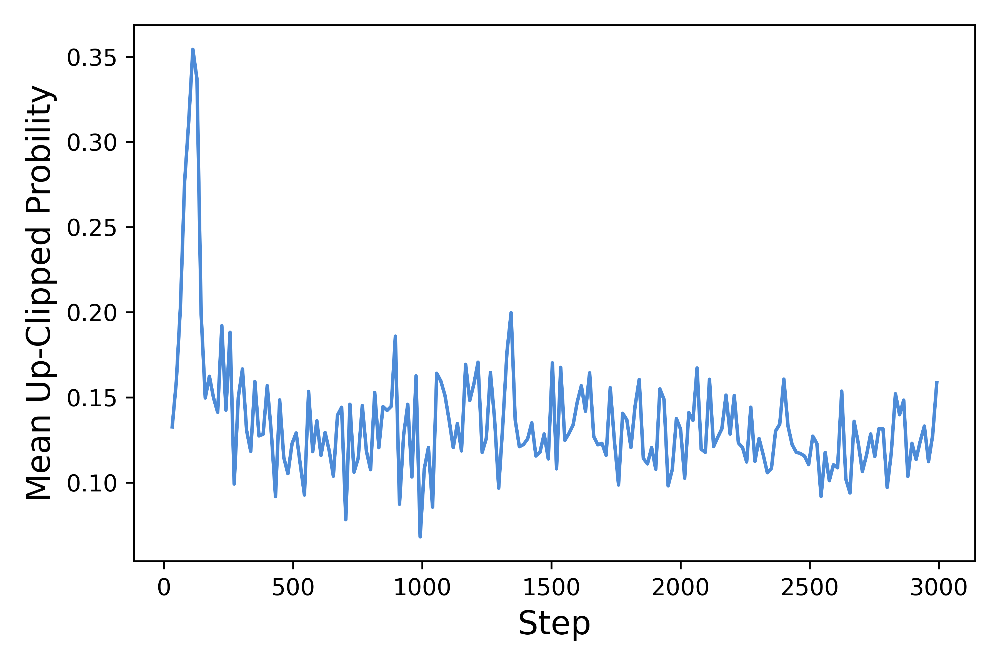

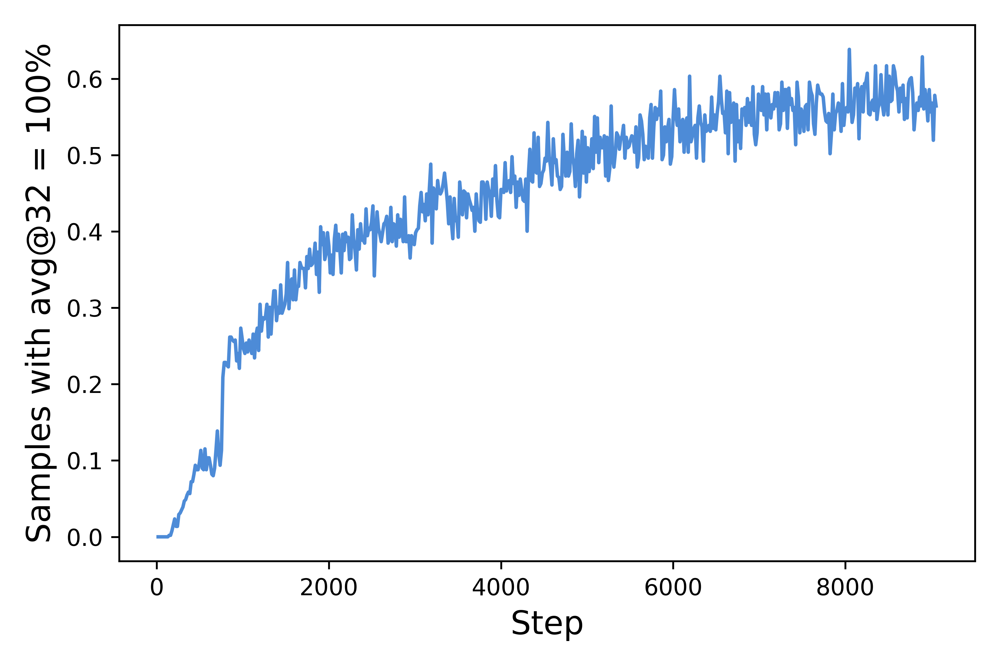

**图 3：** 平均上裁剪概率，以及准确率为 1 的提示词比例。

### 3.2 越多越好：动态采样

当某些提示词的准确率等于 1 时，现有 RL 算法会遭遇梯度减小问题。例如，对于 GRPO，如果某一提示词的全部输出 $\{o_i\}_{i=1}^{G}$ 都正确并获得相同奖励，则该群组得到的优势为**零**。零优势会导致策略梯度为零，减小梯度幅度并提高批次梯度对噪声的敏感性，从而降低样本效率。

经验上，准确率等于 1 的样本数量会持续增加，如图 3(b) 所示。这意味着每个批次中的有效提示词数量不断减少，可能导致梯度方差增大并削弱用于模型训练的梯度信号。

为此，我们提出对提示词进行**过采样，并过滤掉准确率等于 1 和 0 的提示词**，如公式（11）所示；这样可以使批次中的所有提示词都产生有效梯度，并保持提示词数量稳定。每个批次的采样成本是动态的。训练前，我们持续采样，直到批次被准确率既非 0 也非 1 的样本完全填满。

$$
\begin{aligned}
\mathcal{J}_{\text{DAPO}}(\theta)=\quad&\mathbb{E}_{(q,a)\sim\mathcal{D},\{o_i\}_{i=1}^{G}\sim\pi_{\theta_{\text{old}}}(\cdot\mid q)}\\
&\Bigg[\frac{1}{\sum_{i=1}^{G}|o_i|}\sum_{i=1}^{G}\sum_{t=1}^{|o_i|}\min\Big(r_{i,t}(\theta)\hat{A}_{i,t},\ \text{clip}\big(r_{i,t}(\theta),1-\varepsilon_{\text{low}},1+\varepsilon_{\text{high}}\big)\hat{A}_{i,t}\Big)\Bigg]\\
\text{s.t.}\quad&0<\Big|\{o_i\mid\texttt{is\_equivalent}(a,o_i)\}\Big|<G.
\end{aligned}
\tag{11}
$$

需要注意的是，这一策略不一定会妨碍训练效率，因为在 RL 系统同步且生成阶段未采用流水线时，生成时间通常由长尾样本主导。此外，我们发现，采用动态采样后实验能更快达到相同性能，如图 6 所示。

### 3.3 再平衡：Token 级策略梯度损失

原始 GRPO 采用样本级损失计算：首先对每个样本内的 token 损失取平均，然后聚合不同样本的损失。在这种方法中，每个样本在最终损失计算中具有相同权重。然而，我们发现，在长 CoT 强化学习场景中，这种损失归约方式会带来若干挑战。

由于所有样本在损失计算中权重相同，较长响应中的 token（其 token 数更多）对总体损失的贡献可能被不成比例地降低，从而产生两种不利影响。第一，对于高质量的长样本，这会妨碍模型学习其中与推理相关的模式。第二，我们观察到，过长样本通常会呈现乱码、词语重复等低质量模式。因此，样本级损失计算无法有效惩罚长样本中的这些不良模式，导致熵和响应长度不健康地增长，如图 4(a) 和图 4(b) 所示。

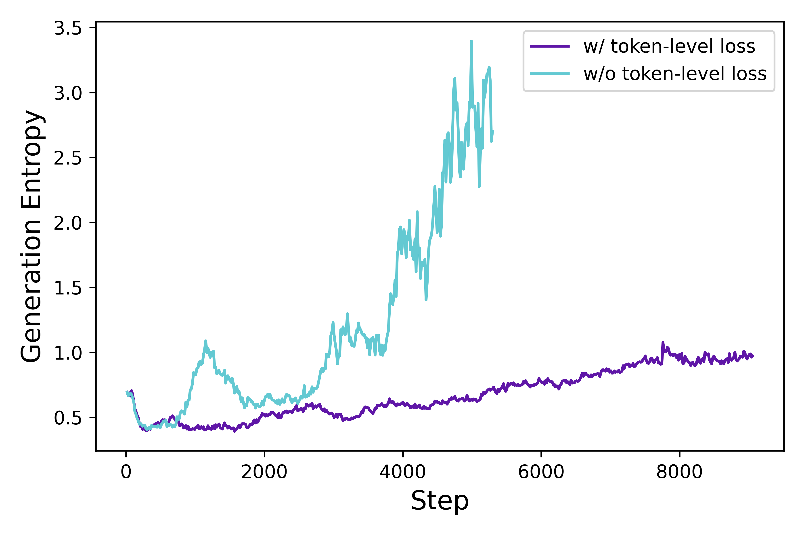

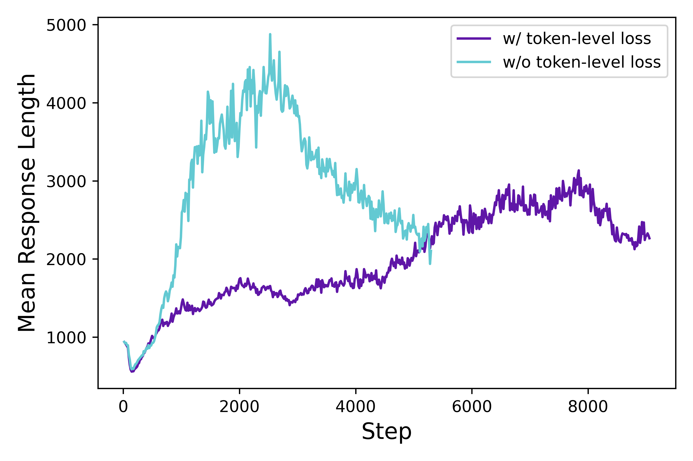

**图 4：** Actor 模型概率分布的熵，以及响应长度的变化。

为解决上述限制，我们在长 CoT 强化学习场景中引入 **Token 级策略梯度损失**：

$$
\begin{aligned}
\mathcal{J}_{\text{DAPO}}(\theta)=\quad&\mathbb{E}_{(q,a)\sim\mathcal{D},\{o_i\}_{i=1}^{G}\sim\pi_{\theta_{\text{old}}}(\cdot\mid q)}\\
&\Bigg[\frac{1}{\sum_{i=1}^{G}|o_i|}\sum_{i=1}^{G}\sum_{t=1}^{|o_i|}\min\Big(r_{i,t}(\theta)\hat{A}_{i,t},\ \text{clip}\big(r_{i,t}(\theta),1-\varepsilon_{\text{low}},1+\varepsilon_{\text{high}}\big)\hat{A}_{i,t}\Big)\Bigg],\\
\text{s.t.}\quad&0<\Big|\{o_i\mid\texttt{is\_equivalent}(a,o_i)\}\Big|<G.
\end{aligned}
\tag{12}
$$

在这一设置下，与较短序列相比，较长序列可以对总体梯度更新产生更大影响。此外，从单个 token 的角度看，如果某种生成模式能够带来奖励增加或减少，那么无论它出现在哪种长度的响应中，都会受到同等程度的促进或抑制。

### 3.4 捉迷藏：超长奖励塑形

在 RL 训练中，我们通常为生成设置最大长度，并相应截断超长样本。我们发现，对截断样本进行不恰当的奖励塑形会引入奖励噪声，并严重干扰训练过程。

默认情况下，我们会对截断样本给予惩罚性奖励。这种方法可能在训练过程中引入噪声，因为一个合理的推理过程可能仅仅由于长度过长而受到惩罚。这类惩罚可能使模型混淆其推理过程是否有效。

为研究这种奖励噪声的影响，我们首先应用**超长过滤（Overlong Filtering）**策略，将截断样本的损失屏蔽掉。我们发现，这种方法显著稳定了训练并提升了性能，如图 5 所示。

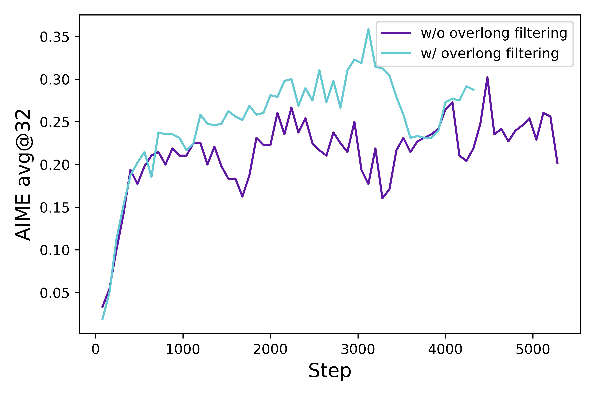

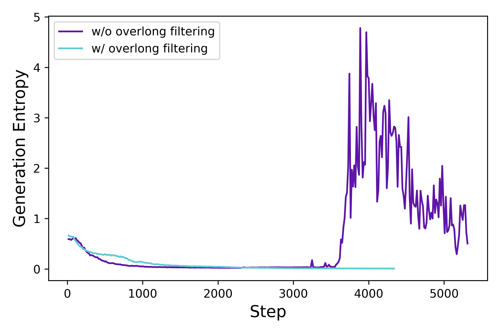

**图 5：** Actor 模型在 AIME 上的准确率及其生成概率的熵，分别展示应用超长奖励塑形策略前后的结果。

#### 算法 1：DAPO

**DAPO：解耦裁剪与动态采样策略优化**

**输入：** 初始策略模型 $\pi_\theta$；奖励模型 $R$；任务提示词 $\mathcal{D}$；超参数 $\varepsilon_\mathtt{low},\varepsilon_\mathtt{high}$。

1. 对 `step = 1, ..., M` 循环：
2. 从 $\mathcal{D}$ 中采样一个批次 $\mathcal{D}_b$。
3. 更新旧策略模型：$\pi_{\theta_{old}}\leftarrow\pi_\theta$。
4. 对于 $\mathcal{D}_b$ 中的每个问题 $q$，从 $\pi_{\theta_{old}}(\cdot\mid q)$ 采样 $G$ 个输出 $\{o_i\}_{i=1}^{G}$。
5. 运行 $R$，为每个采样输出 $o_i$ 计算奖励 $\{r_i\}_{i=1}^{G}$。
6. 过滤掉 $o_i$，将剩余输出加入动态采样缓冲区（动态采样，见公式（11））。
7. 如果缓冲区大小 $n_b<N$：
8. 　　继续循环。
9. 对缓冲区中的每个 $o_i$，计算 $o_i$ 第 $t$ 个 token 的 $\hat{A}_{i,t}$（公式（9））。
10. 对 `iteration = 1, ..., μ` 循环：
11. 　　通过最大化 DAPO 目标（公式（8））更新策略模型 $\pi_\theta$。

**输出：** $\pi_\theta$。

此外，我们提出**软超长惩罚（Soft Overlong Punishment）**（公式（13）），这是一种与长度相关的惩罚机制，用于塑造截断样本的奖励。具体而言，当响应长度超过预先设定的最大值时，我们定义一个惩罚区间。在该区间内，响应越长，受到的惩罚越大。这一惩罚会加到原始的基于规则的正确性奖励上，从而向模型传达避免过度冗长响应的信号。

$$
R_{\text{length}}(y)=
\begin{cases}
0,&|y|\leq L_{\text{max}}-L_{\text{cache}}\\
\dfrac{(L_{\text{max}}-L_{\text{cache}})-|y|}{L_{\text{cache}}},&L_{\text{max}}-L_{\text{cache}}<|y|\leq L_{\text{max}}\\
-1,&L_{\text{max}}<|y|
\end{cases}
\tag{13}
$$

### 3.5 数据集转换

我们的数据集来自互联网和官方竞赛主页，经过网页抓取与人工标注相结合的方式构建。数学数据集的答案通常采用多种格式，例如表达式、公式和数字，这使得设计全面的解析规则变得困难。为了通过规则提供准确的奖励信号，并减少公式解析器引入的错误，我们受到 AIME 启发，将答案筛选并转换为整数，因为整数易于解析。

例如，如果原始答案表示为 $\frac{a+\sqrt{b}}{c}$，我们会指示 LLM 修改问题，使期望答案变为 $a+b+c$。经过筛选和转换，我们获得了 **DAPO-Math-17K** 数据集，其中包含 17K 个提示词，每个提示词都配有一个整数答案。

## 4 实验

### 4.1 训练细节

本文专门聚焦数学任务来评估算法，但该算法可以直接迁移到其他任务。我们采用 verl 框架进行训练。我们使用朴素 GRPO 作为基线算法，并通过群组奖励归一化估计优势。

在超参数方面，我们使用 AdamW 优化器，恒定学习率为 $1\times10^{-6}$，并在 20 个 rollout 步骤上进行线性预热。对于 rollout，提示词批次大小为 512，每个提示词采样 16 个响应。对于训练，mini-batch 大小设为 512，即每个 rollout 步骤进行 16 次梯度更新。对于超长奖励塑形，我们将预期最大长度设为 16,384 个 token，并额外分配 4,096 个 token 作为软惩罚缓存。

因此，生成的最大 token 数设为 20,480。对于 Clip-Higher 机制，我们将裁剪参数 $\varepsilon_{\text{low}}$ 设为 0.2，将 $\varepsilon_{\text{high}}$ 设为 0.28，有效平衡探索与利用之间的权衡。为了评估 AIME，我们将评估集重复 32 次，并报告 avg@32，以提高结果稳定性。评估时的推理超参数设置为温度 1.0 和 topp 0.7。

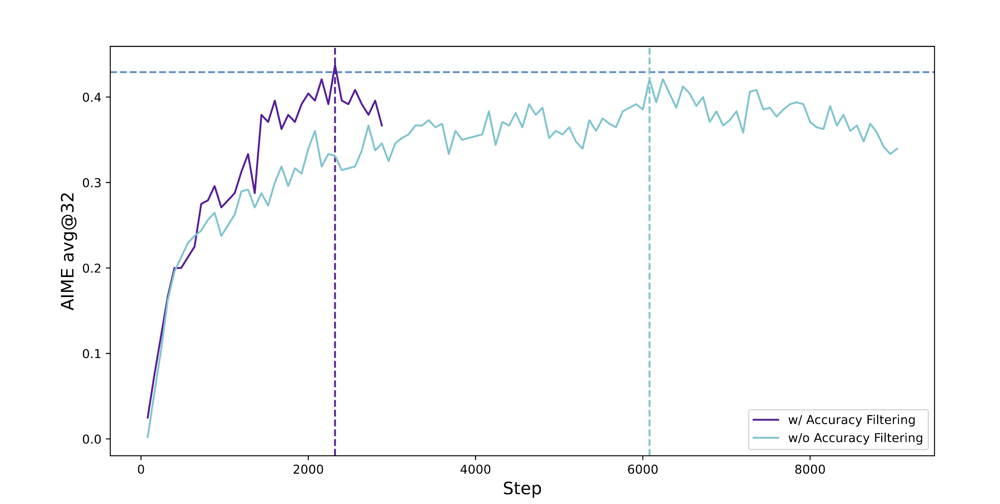

**图 6：** 基线设置下应用动态采样前后的训练进展。

### 4.2 主要结果

在 AIME 2024 上的实验表明，DAPO 已成功将 Qwen-32B Base 模型训练为强大的推理模型，其性能优于 DeepSeek 使用 R1 方法在 Qwen2.5-32B 上进行的实验。在图 1 中，我们观察到 AIME 2024 性能显著提升，准确率从接近 0% 增至 50%。值得注意的是，这一提升只使用了 DeepSeek-R1-Zero-Qwen-32B 所需训练步数的 50%。

我们分析了方法中每项训练技术的贡献，详见表 1。观察到的提升证明了这些技术在 RL 训练中的有效性：每项技术都为 AIME 2024 带来了若干准确率百分点的增益。值得注意的是，在原始 GRPO 设置下，从 Qwen2.5-32B 基础模型训练只能达到 30% 的准确率。

对于 token 级损失，尽管它带来的性能提升较小，但我们发现它增强了训练稳定性，并使长度增长更加健康。

应用动态采样时，由于过滤掉零梯度数据，需要采样更多数据，但总体训练时间并未受到显著影响。如图 6 所示，尽管采样实例数量增加，模型的收敛时间反而缩短了，这是因为所需训练步数更少。

**表 1：逐步应用 DAPO 技术的主要结果**

| 模型/设置 | $\textbf{AIME24}_{\text{avg@32}}$ |
|---|---:|
| DeepSeek-R1-Zero-Qwen-32B | 47 |
| 朴素 GRPO | 30 |
| + 超长过滤 | 36 |
| + Clip-Higher | 38 |
| + 软超长惩罚 | 41 |
| + Token 级损失 | 42 |
| + 动态采样（DAPO） | **50** |

### 4.3 训练动态

大语言模型上的强化学习不仅是前沿研究方向，也是一项内在复杂的系统工程挑战，其特征是各子系统相互依赖。由于各组件之间存在复杂交互，对单个子系统的修改可能在系统中传播，并导致无法预见的后果。

即使是初始条件中看似微小的变化，例如数据和超参数的变化，也可能在迭代强化学习过程中被放大，从而使最终结果产生显著偏差。这种复杂性经常使研究人员陷入两难：即便经过细致分析并有充分依据地预期某项修改会改善训练过程的特定方面，实际结果也常常偏离预期轨迹。

因此，在实验过程中监控关键中间结果，对于快速定位差异来源并最终改进系统至关重要。

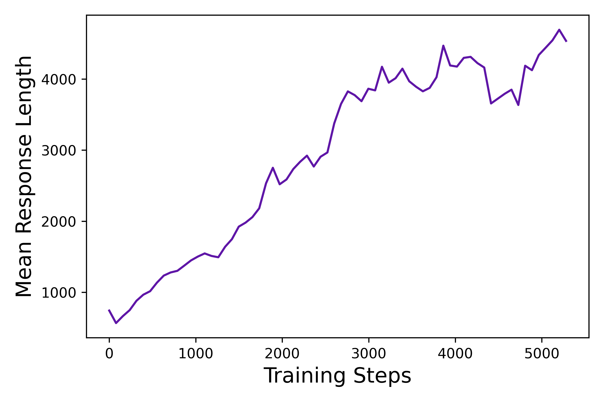

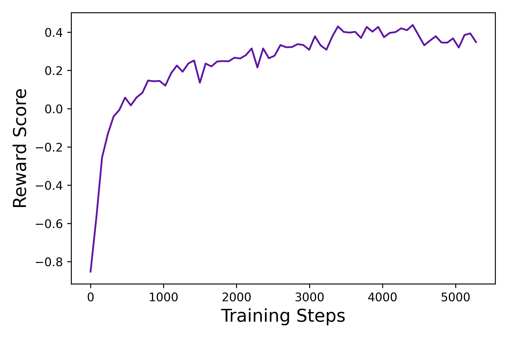

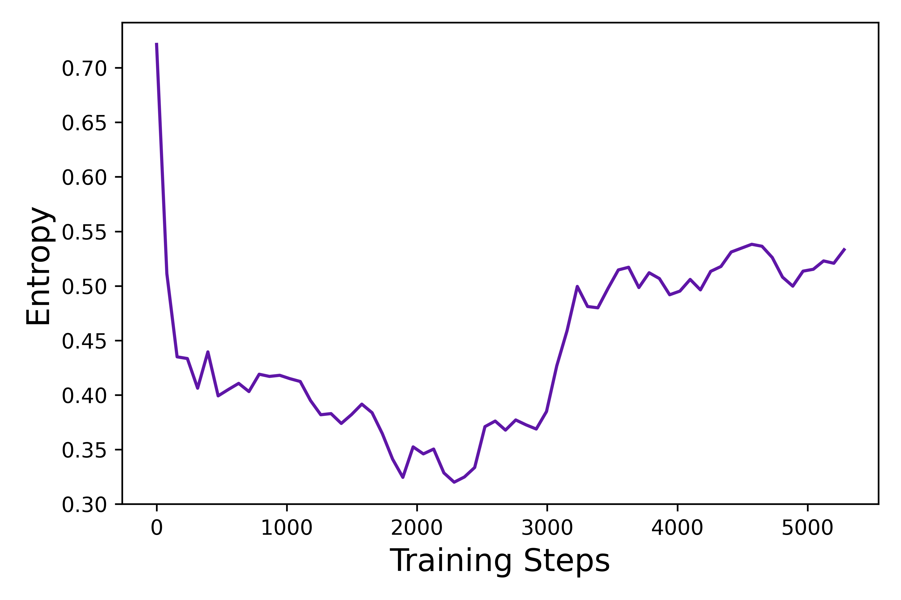

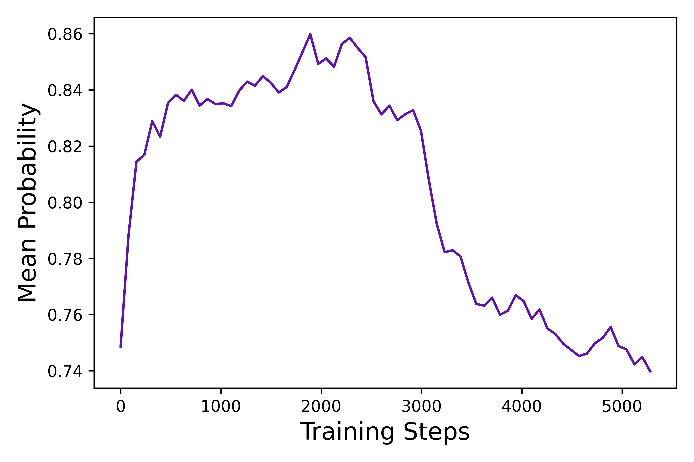

**图 7：** DAPO 的响应长度、奖励分数、生成熵和平均概率指标曲线，展示 RL 训练动态，并作为识别潜在问题的重要监控指标。

- **生成响应的长度**是与训练稳定性和性能密切相关的指标，如图 7(a) 所示。长度增加为模型提供了更大的探索空间，使其能够采样更复杂的推理行为，并在训练中逐渐强化这些行为。然而，需要注意的是，长度在训练过程中并不总是持续上升。在某些较长阶段，它可能停滞甚至下降，这一点也已在相关工作中得到证明。我们通常将长度与验证准确率结合起来，用作判断实验是否恶化的指标。

- **训练过程中的奖励动态**一直是强化学习的重要监控指标之一，如图 7(b) 所示。在我们大多数实验中，奖励增长趋势相对稳定，不会因实验设置调整而显著波动或下降。这表明，在奖励信号可靠的情况下，语言模型可以稳健地拟合训练集分布。然而，我们发现训练集上的最终奖励通常与验证集准确率几乎没有相关性，这说明模型可能过拟合训练集。

- **Actor 模型的熵和生成概率**与模型的探索能力有关，是我们在实验中密切监控的关键指标。直观而言，模型熵需要维持在适当范围内。过低的熵表示概率分布过于尖锐，导致探索能力丧失。相反，过高的熵通常与过度探索问题相关，例如乱码和重复生成。对于生成概率，情况恰好相反。如第 3.1 节所示，通过应用 Clip-Higher 策略，我们有效解决了熵坍塌问题。在后续实验中，我们发现保持熵缓慢上升有利于模型性能提升，如图 7(c) 和图 7(d) 所示。

### 4.4 案例研究

**问题：**已知四面体 $S-ABC$ 的底面 $ABC$ 是等边三角形，点 $A$ 在面 $SBC$ 上的投影 $H$ 是 $\triangle SBC$ 的垂心，二面角 $H-AB-C$ 为 $30^\circ$，且 $SA=2$，求该四面体的体积。答案形式为 $\frac{k}{m}$，求 $k+m$ 的值。

**响应：**

让我们考虑给定问题：我们需要确定 ……

……

接下来，令 $S$ 的坐标为 $(x_0,y_0,z_0)$。由于 $SA=2$，由距离公式可得 $\sqrt{(x_0)^2+(y_0)^2+(z_0)^2}=2$，因此可以写成 $x_0^2+y_0^2+z_0^2=4$。现在，请记住 $H$ 是 …… 的正交投影。

……

**然而，等等，让我们以更严谨的几何方式重新思考涉及平面的二面角。**考虑平面 $\alpha_1=ABC$，它完全位于 xy 坐标平面上（即 $z=0$）。设平面 $\alpha_2=SBC$。点 $A$ 垂直投影到平面 $\alpha_2$ 后落在 $H$。直线 $l=AB$ ……

……

**表 2：强化学习中反思行为的出现**

在 RL 训练过程中，我们观察到一个有趣现象：Actor 模型的推理模式会随时间动态演化。具体而言，该算法不仅强化有助于正确解题的已有推理模式，还会逐渐产生训练初期不存在的全新推理方式。这一发现揭示了 RL 算法的适应性和探索能力，并为理解模型的学习机制提供了新视角。

例如，在模型训练早期，几乎没有检查和反思先前推理步骤的行为。然而，随着训练推进，模型展现出明显的反思和回溯行为，如表 2 所示。这一观察为进一步解释推理能力的涌现提供了线索，相关研究留待未来开展。

## 5 结论

本文发布了一个用于大规模 LLM 强化学习的完整开源系统，包括算法、代码基础设施和数据集。该系统取得了当前最佳水平的大规模 LLM 强化学习性能（使用 Qwen-32B 预训练模型在 AIME 上取得 50 分）。我们提出解耦裁剪与动态采样策略优化（DAPO）算法，并引入四项关键技术，使长 CoT 强化学习场景中的 RL 更有效、更高效。

此外，通过开源训练代码和数据集，我们为更广泛的研究社区和社会提供了可扩展强化学习解决方案的实际访问途径，使所有人都能从这些进展中受益。

## 贡献者

### 项目负责人

Qiying Yu¹˒²˒⁴

### 算法

Qiying Yu¹˒²˒⁴、Zheng Zhang¹、Ruofei Zhu¹、Yufeng Yuan¹、Xiaochen Zuo¹、Yu Yue¹

### 基础设施*

Weinan Dai¹˒²˒⁴、Tiantian Fan¹、Gaohong Liu¹、Juncai Liu¹、Lingjun Liu¹、Xin Liu¹、Haibin Lin¹、Zhiqi Lin¹、Bole Ma¹、Guangming Sheng¹˒³、Yuxuan Tong¹˒²˒⁴、Qiying Yu¹˒²˒⁴、Chi Zhang¹、Mofan Zhang¹、Ru Zhang¹、Wang Zhang¹、Hang Zhu¹、Jinhua Zhu¹

\* 姓氏按字母顺序排列。

### 数据集

Jiaze Chen¹、Jiangjie Chen¹˒⁴、Chengyi Wang¹、Hongli Yu¹˒²˒⁴、Yuxuan Song¹˒²˒⁴、Xiangpeng Wei¹、Qiying Yu¹˒²˒⁴

### 监督

Hao Zhou²˒⁴、Jingjing Liu²˒⁴、Wei-Ying Ma²˒⁴、Ya-Qin Zhang²˒⁴、Lin Yan¹˒⁴、Mu Qiao¹˒⁴、Yonghui Wu¹、Mingxuan Wang¹˒⁴

### 单位

1. 字节跳动 Seed
2. 清华大学人工智能产业研究院（AIR）
3. 香港大学
4. 清华大学 AIR 与字节跳动 Seed 联合实验室（SIA-Lab）

## 致谢

感谢 Zhengyin Du、Shengding Hu、Kai Shen、Tianyang Zhan、Zhen Xiao、Renjie Zheng、Li Han、Kaihua Jiang，以及字节跳动其他同事对 DAPO 项目的支持。

## 参考文献

> 下列作者姓名、年份、期刊/会议、卷页码和 arXiv 编号按原文保留；文献题名翻译为中文。

1. OpenAI. 《让 LLM 学会推理》，2024。
2. Daya Guo 等。《DeepSeek-R1：通过强化学习激发 LLM 的推理能力》。arXiv 预印本 arXiv:2501.12948，2025。
3. OpenAI。《GPT-4 技术报告》。arXiv 预印本 arXiv:2303.08774，2023。
4. Anthropic。《Claude 3.5 Sonnet》，2024。
5. Tom Brown 等。《语言模型是少样本学习器》。Advances in Neural Information Processing Systems，33:1877-1901，2020。
6. Aakanksha Chowdhery 等。《PaLM：使用 Pathways 扩展语言建模》。Journal of Machine Learning Research，24(240):1-113，2023。
7. Aixin Liu 等。《DeepSeek-V3 技术报告》。arXiv 预印本 arXiv:2412.19437，2024。
8. XAI。《Grok 3 Beta——推理智能体时代》，2024。
9. Google DeepMind。《Gemini 2.0 Flash Thinking》，2024。
10. Qwen。《QwQ-32B：拥抱强化学习的力量》，2024。
11. Kimi Team 等。《Kimi k1.5：使用 LLM 扩展强化学习》。arXiv 预印本 arXiv:2501.12599，2025。
12. An Yang 等。《Qwen2.5 技术报告》。arXiv 预印本 arXiv:2412.15115，2024。
13. Zhipeng Chen 等。《诱导和改进类 R1 推理模型的实证研究》。arXiv 预印本 arXiv:2503.04548，2025。
14. Jingcheng Hu 等。《Open-Reasoner-Zero：一种在基础模型上扩展强化学习的开源方法》。<https://github.com/Open-Reasoner-Zero/Open-Reasoner-Zero>，2025。
15. Jian Hu。《Reinforce++：一种简单高效的大语言模型对齐方法》。arXiv 预印本 arXiv:2501.03262，2025。
16. Ganqu Cui 等。《通过隐式奖励进行过程强化》。arXiv 预印本 arXiv:2502.01456，2025。
17. Jung Hyun Lee 等。《用于增强大语言模型数学推理能力的 token 监督价值模型》。arXiv 预印本 arXiv:2407.12863，2024。
18. Amirhossein Kazemnejad 等。《VinePPO：通过精细信用分配释放 LLM 推理的 RL 潜力》。arXiv 预印本 arXiv:2410.01679，2024。
19. Yufeng Yuan 等。《长 CoT 中 PPO 崩溃的背后是什么？价值优化揭示了秘密》。arXiv 预印本 arXiv:2503.01491，2025。
20. Guangming Sheng 等。《HybridFlow：灵活高效的 RLHF 框架》。arXiv 预印本 arXiv:2409.19256，2024。
21. John Schulman 等。《近端策略优化算法》。arXiv 预印本 arXiv:1707.06347，2017。
22. John Schulman 等。《使用广义优势估计的高维连续控制》，2018。
23. Long Ouyang 等。《训练语言模型遵循人类反馈的指令》。Advances in Neural Information Processing Systems，35:27730-27744，2022。
24. Dario Amodei 等。《AI 安全中的具体问题》，2016。
25. Tom Everitt 等。《带有损坏奖励通道的强化学习》，2017。
26. Victoria Krakovna 等。《规范博弈：AI 独创性的另一面》，2020。
27. Tom Everitt 等。《强化学习中的奖励篡改问题与解决方案：因果影响图视角》，2021。
28. Leo Gao 等。《奖励模型过度优化的缩放定律》，2022。
29. Lilian Weng。《强化学习中的奖励劫持》。lilianweng.github.io，2024 年 11 月。
30. Stanislas Polu、Ilya Sutskever。《用于自动定理证明的生成式语言建模》，2020。
31. Trieu H. Trinh 等。《无需人工示范解决奥林匹克几何问题》。Nature，625(7995):476-482，2024。
32. Trieu Trinh、Thang Luong。《AlphaGeometry：达到奥林匹克竞赛水平的 AI 几何系统》，2024。
33. AlphaProof and AlphaGeometry Teams。《AI 达到解决国际数学奥林匹克问题的银牌水平》，2024。
34. Hung Le 等。《CodeRL：通过预训练模型和深度强化学习掌握代码生成》。Advances in Neural Information Processing Systems，35:21314-21328，2022。
35. Noah Shinn 等。《Reflexion：通过语言强化学习训练智能体》，2023。
36. Xinyun Chen 等。《教会大语言模型自我调试》，2023。
37. Jonas Gehring 等。《RLEF：通过执行反馈将代码 LLM 扎根于强化学习》，2025。
38. Zhihong Shao 等。《DeepSeekMath：突破开源语言模型数学推理的极限》。arXiv 预印本 arXiv:2402.03300，2024。
39. Ilya Loshchilov、Frank Hutter。《解耦权重衰减正则化》。International Conference on Learning Representations，2019。

## 附录 A 数据集转换

下面给出一个数据转换示例，展示转换过程中的原始问题、转换后问题以及模型输出（原始内容为 Markdown 文本，此处为便于阅读而渲染）。

为了确保模型能够高准确率地完成该任务，我们希望它进行全面推理，同时避免幻觉。我们通过提供清晰的思考框架来实现这一点，该框架鼓励完整推理。具体而言，我们采用带有四个明确定义步骤的思维链（CoT）推理：提取答案格式、重写问题陈述、解决修改后的问题，以及提供整数作为最终答案。

对于每个步骤，我们提供少样本解答或详细指南，以引导模型进行推理。

通过这种方法，我们观察到，在大多数情况下，LLM 可以生成格式和质量都令人满意的改写结果。

### 原始问题

设 $x$ 和 $y$ 为实数，满足

$$x^2+y^2-22x-16y+113=0.$$

求 $x$ 的最小可能值。**答案：$11-2\sqrt{6}$**

### 转换后问题

设 $x$ 和 $y$ 为实数，满足

$$x^2+y^2-22x-16y+113=0.$$

求 $x$ 的最小可能值。原答案形式为 $k-m\sqrt{n}$，其中 $k$、$m$ 和 $n$ 为整数。请计算 $k+m+n$。**答案：$19$**

### 模型输出（Markdown 文本）

#### 转换思考过程

原问题的答案是代数表达式 $11-2\sqrt{6}$。我们需要将其转换为整数形式。首先注意，答案由整数部分和平方根项组成。根据给定规则，我们用待定系数替换整数和平方根的组成部分。原问题使用 $x$ 和 $y$ 作为变量，因此我们选择其他字母作为待定系数。

我们将答案表示为 $k-m\sqrt{n}$ 的形式，并要求学生求出 $k+m+n$。

#### 答案格式

$$k-m\sqrt{n}$$

#### 转换后问题

设 $x$ 和 $y$ 为实数，满足

$$x^2+y^2-22x-16y+113=0.$$

求 $x$ 的最小可能值。原答案形式为 $k-m\sqrt{n}$，其中 $k$、$m$ 和 $n$ 为整数。请计算 $k+m+n$。

#### 转换后问题的答案计算

- 原答案为：$11-2\sqrt{6}$。
- 要求的格式为：$k-m\sqrt{n}$。
- 匹配系数：$k=11$，$m=2$，$n=6$。
- 最终结果为：$k+m+n=11+2+6=19$。

#### 最终答案

$$19$$

## 附录 B 补充案例

### 问题

Aimeville 有 900 名居民，其中 195 人拥有钻石戒指，367 人拥有一套高尔夫球杆，562 人拥有园艺铲。此外，900 名居民每人都有一袋糖果心。有 437 名居民恰好拥有这四类物品中的两类，234 名居民恰好拥有其中三类。求 Aimeville 中同时拥有全部四类物品的居民人数。

### 响应

#### 逐步解答

1. 让我们定义以下变量：
   - 令 $A$ 为拥有钻石戒指的居民集合。
   - 令 $B$ 为拥有一套高尔夫球杆的居民集合。
   - 令 $C$ 为拥有园艺铲的居民集合。
   - 令 $D$ 为拥有一袋糖果心的居民集合。由于全部 900 名居民都有一袋糖果心，因此 $|D|=900$。
2. 令 $a_i$ 表示恰好拥有 4 类物品中的 $i$ 类的居民人数。
3. 让我们对四个集合 $A,B,C,D$ 使用容斥原理。

……

$$a_4=\frac{-219}{-4}=\frac{219}{4}=54.75.$$

**由于 $a_4$（拥有全部四类物品的人数）必须是整数，因此当前方法需要从不同物品组合人数的组合计数角度重新考虑。**

我们不直接使用容斥原理，而采用另一种涉及 $A$、$B$、$C$ 和 $D$ 组合人数的方法。

令 $x_i$ 表示在 $A$、$B$、$C$ 中恰好拥有 $i$ 类物品的人数（**排除物品 $D$，因为每个人都有 $D$**）。

于是，$A$、$B$、$C$、$D$ 四类物品中恰好拥有 $k$ 类物品的总人数可以分解为：

……

> **译注：** 附录 B 的 LaTeX 源文件在此处原本就以省略号结束，未提供后续推导或最终数值；译文保留这一内容，不补写推导。

## 原文歧义与排版标注

- 公式（4）左侧使用 $\hat{A}_{i,t}$，右侧分子却写作 $r_i$，而不是与奖励记号一致的 $R_i$；译文按原式保留。
- 论文标题正文在不同位置出现 “Decoupled Clip” 与 “Decouple Clip” 两种写法；译文统一采用摘要中的“解耦裁剪”，并保留英文缩写 DAPO。
- 算法输入行在源文件中将 `reward` 拼写为 `reawrd`；译文按语义翻译为“奖励模型”，未修改原文算法含义。
- 图 1、图 2、图 3、图 4、图 5、图 6、图 7 的 PNG 文件来自论文 LaTeX 源文件，仅用于在 Markdown 中保留原图位置与图注。
