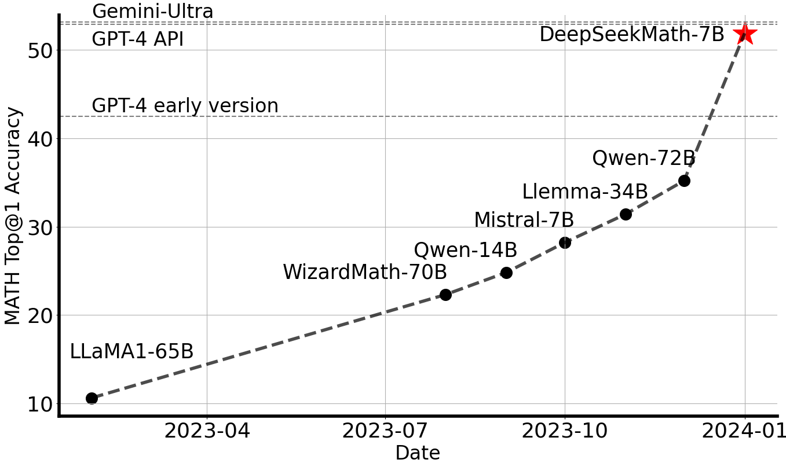
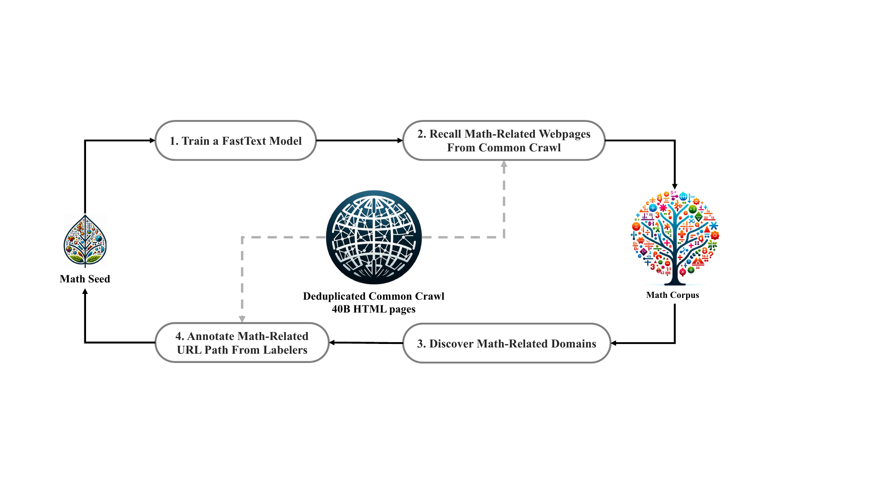
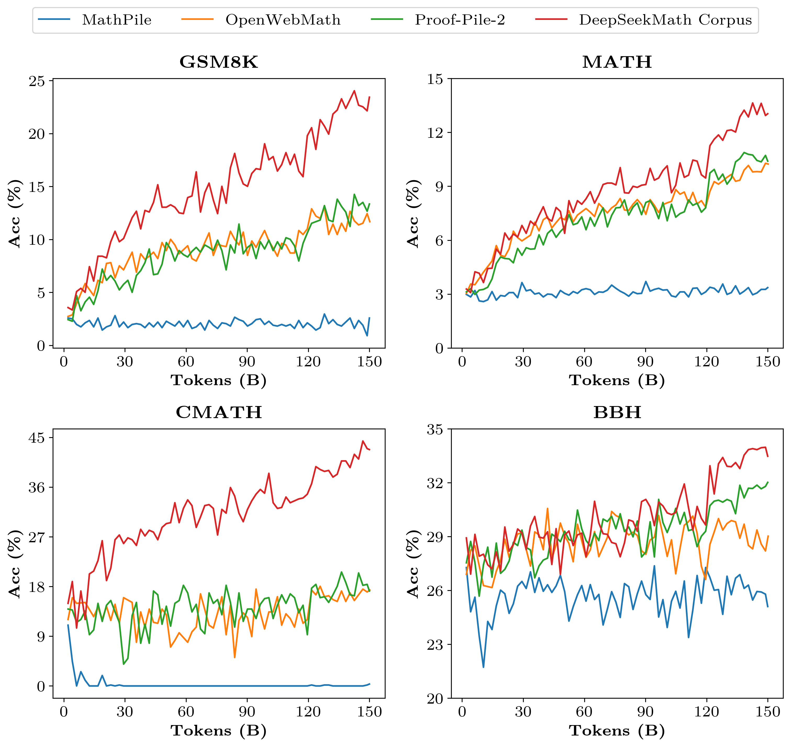
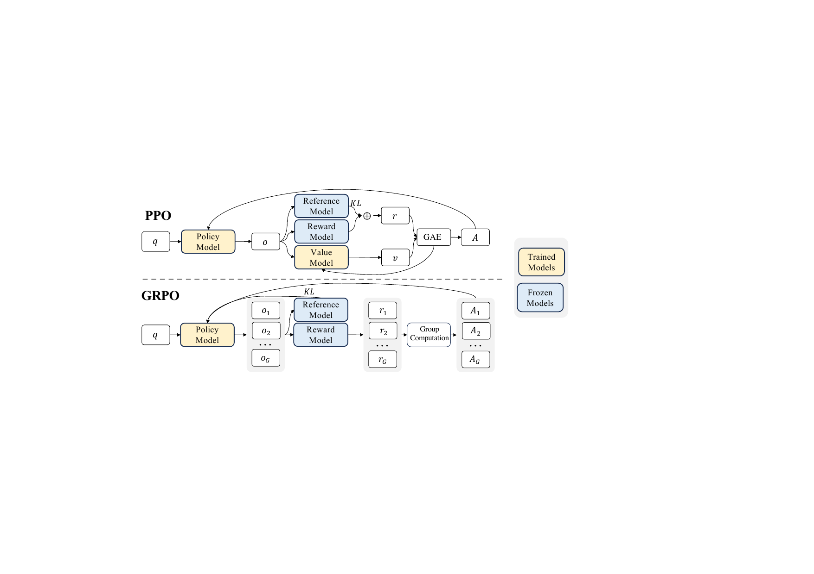
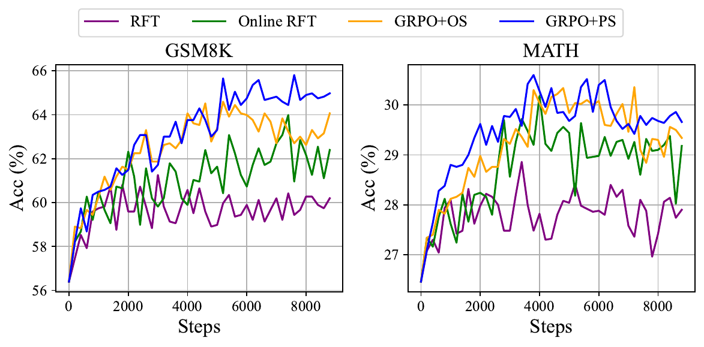
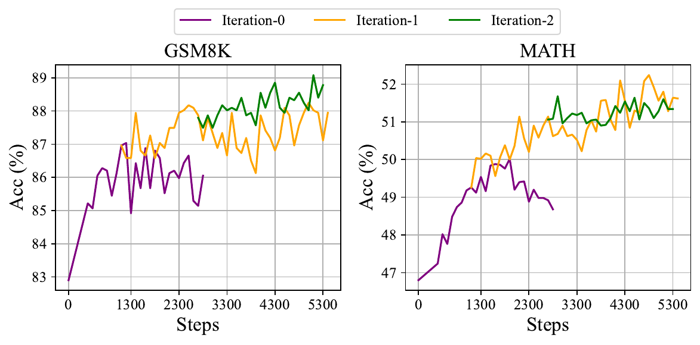
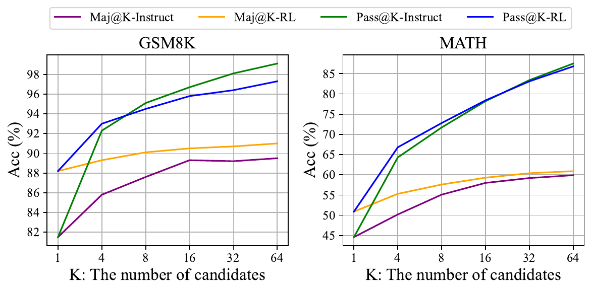

# DeepSeekMath：突破开源语言模型数学推理的极限

**英文原题：** DeepSeekMath: Pushing the Limits of Mathematical Reasoning in Open Language Models  
**版本：** arXiv:2402.03300v3（2024 年 4 月 27 日修订）  
**原文链接：** <https://arxiv.org/abs/2402.03300>  
**代码仓库：** <https://github.com/deepseek-ai/DeepSeek-Math>

**作者：** Zhihong Shao，Peiyi Wang，Qihao Zhu，Runxin Xu，Junxiao Song，Xiao Bi，Haowei Zhang，Mingchuan Zhang，Y.K. Li，Y. Wu，Daya Guo。  
**单位：** DeepSeek-AI；清华大学；北京大学。  
**说明：** `*` 表示核心贡献者；`†` 表示在 DeepSeek-AI 实习期间完成的工作。

> **翻译说明：** 本文仅做语言翻译。公式、变量、数值、模型名、数据集名和引用编号保持原样；原文中的排版笔误或符号不一致不主动修正，并在文末集中标注。表格中的 `-` 表示原文缺失或未报告。

## 摘要

由于数学推理具有复杂且结构化的性质，它对语言模型提出了重大挑战。本文介绍 DeepSeekMath 7B：在 DeepSeek-Coder-Base-v1.5 7B 的基础上继续预训练，使用来自 Common Crawl 的 120B 数学相关 token，并结合自然语言和代码数据。

DeepSeekMath 7B 在竞赛级 MATH 基准上取得了 51.7% 的出色成绩，不依赖外部工具包和投票技术，接近 Gemini-Ultra 和 GPT-4 的性能水平。对 DeepSeekMath 7B 的 64 个样本进行自一致性（self-consistency）评估，在 MATH 上达到 60.9%。

DeepSeekMath 的数学推理能力归因于两个关键因素。第一，我们通过精心设计的数据选择流水线，充分挖掘公开网页数据的潜力。第二，我们提出**群组相对策略优化（Group Relative Policy Optimization，GRPO）**，这是近端策略优化（PPO）的一种变体，在提升数学推理能力的同时优化 PPO 的内存使用。

**图 1：** 不使用外部工具包和投票技术时，开源模型在竞赛级 MATH 基准上的 Top-1 准确率。

## 1 引言

大语言模型（LLM）彻底改变了人工智能进行数学推理的方式，推动了定量推理基准（MATH）和几何推理基准的发展。此外，这些模型已经被证明能够有效协助人类解决复杂数学问题。然而，GPT-4、Gemini-Ultra 等最前沿模型并未公开，当前可用的开源模型在性能上仍明显落后。

在本研究中，我们介绍 DeepSeekMath，一种领域专用语言模型。它在学术基准上显著超越开源模型的数学能力，并接近 GPT-4 的性能水平。为此，我们构建了 DeepSeekMath Corpus，一个包含 120B 数学 token 的大规模高质量预训练语料库。该数据集使用基于 fastText 的分类器从 Common Crawl（CC）中提取。初始迭代中，分类器使用 OpenWebMath 实例作为正例，并加入多样化网页作为负例；随后用分类器从 CC 中挖掘更多正例，再通过人工标注进一步完善，并用增强后的数据更新分类器。

评估结果表明，该大规模语料库质量很高：我们的基础模型 DeepSeekMath-Base 7B 在 GSM8K 上达到 64.2%，在竞赛级 MATH 数据集上达到 36.2%，超过 Minerva 540B。此外，DeepSeekMath Corpus 是多语言的，因此我们在中文数学基准上也观察到性能提升。我们认为，数学数据处理经验为社区研究提供了起点，未来仍有很大改进空间。

DeepSeekMath-Base 以 DeepSeek-Coder-Base-v1.5 7B 初始化，因为我们发现从代码训练模型开始比从通用 LLM 开始更好。我们还观察到，数学训练能够提升模型在 MMLU 和 BBH 基准上的能力，说明数学训练不仅增强数学能力，也放大了通用推理能力。

预训练后，我们使用思维链（CoT）、思维程序（PoT）和工具集成推理数据，对 DeepSeekMath-Base 进行数学指令微调。得到的 DeepSeekMath-Instruct 7B 超越所有同规模 7B 模型，并可与 70B 开源指令微调模型相媲美。

此外，我们提出群组相对策略优化（GRPO），一种近端策略优化（PPO）的强化学习算法变体。GRPO 不使用 critic 模型，而是从群组得分估计基线，从而显著减少训练资源。仅使用一部分英文指令微调数据，GRPO 在强化学习阶段就显著提升了强大的 DeepSeekMath-Instruct：域内任务 GSM8K 从 82.9% 提升到 88.2%，MATH 从 46.8% 提升到 51.7%；域外数学任务 CMATH 从 84.6% 提升到 88.8%。

我们还提供一个统一范式来理解拒绝采样微调（RFT）、直接偏好优化（DPO）、PPO 和 GRPO 等不同方法。基于该统一范式，我们发现这些方法都可以被概念化为直接 RL 或简化 RL 技术。我们进一步开展在线与离线训练、结果监督与过程监督、单轮与迭代 RL 等大量实验，以深入研究这一范式的关键要素。最后，我们解释 RL 为什么能够提升指令微调模型的性能，并基于统一范式总结实现更有效 LLM 强化学习的潜在方向。

### 1.1 贡献

我们的贡献包括可扩展的数学预训练，以及对强化学习的探索与分析。

#### 大规模数学预训练

- 我们提供了有力证据，表明公开可访问的 Common Crawl 数据包含有价值的数学信息。通过精心设计的数据选择流水线，我们构建了 DeepSeekMath Corpus：从经过数学内容筛选的网页中获得 120B token，规模约为 Minerva 使用的数学网页数据的 7 倍、OpenWebMath 的 9 倍。
- 预训练基础模型 DeepSeekMath-Base 7B 达到与 Minerva 540B 相当的性能，说明参数数量并不是数学推理能力的唯一关键因素。在高质量数据上预训练的较小模型同样可以取得强性能。
- 我们分享数学训练实验的发现。数学训练前的代码训练能够提升模型在使用和不使用工具时解决数学问题的能力，这对“代码训练是否提升推理能力”这一长期问题给出了部分答案。我们认为，至少对于数学推理而言，答案是肯定的。
- 虽然在 arXiv 论文上训练很常见，尤其是在许多数学相关论文中，但它对本文采用的数学基准并未带来显著提升。

#### 强化学习的探索与分析

- 我们提出 GRPO，一种高效且有效的强化学习算法。GRPO 不使用 critic 模型，而是从群组得分估计基线，相比 PPO 显著减少训练资源。
- 我们证明，仅使用指令微调数据就能通过 GRPO 显著提升 DeepSeekMath-Instruct 的性能，并且强化学习过程中域外性能也会提升。
- 我们提供一个统一范式来理解 RFT、DPO、PPO 和 GRPO，并开展在线与离线训练、结果与过程监督、单轮与迭代 RL 等实验，以深入研究统一范式的关键要素。
- 基于该统一范式，我们探讨强化学习有效的原因，并总结实现更有效 LLM 强化学习的若干潜在方向。

### 1.2 评估与指标概览

- **中英文数学推理：** 我们在涵盖小学到大学难度的中英文数学基准上进行全面评估。英文基准包括 GSM8K、MATH、SAT、OCW Courses 和 MMLU-STEM；中文基准包括 MGSM-zh、CMATH、Gaokao-MathCloze 和 Gaokao-MathQA。我们评估模型在不使用工具时生成自包含文字解答的能力，以及使用 Python 解决问题的能力。DeepSeekMath-Base 在英文基准上与闭源 Minerva 540B 竞争，并经常以显著幅度超过所有开源基础模型；在中文基准上表现更优。经过数学指令微调和强化学习后，DeepSeekMath-Instruct 和 DeepSeekMath-RL 首次在开源社区的竞赛级 MATH 数据集上达到超过 50% 的准确率。
- **形式化数学：** 我们使用 Isabelle 作为证明助手，在 miniF2F 上评估 DeepSeekMath-Base 的非形式到形式定理证明能力。DeepSeekMath-Base 展现出较强的少样本自动形式化能力。
- **自然语言理解、推理与代码：** 我们在 MMLU、BBH、HumanEval 和 MBPP 上评估基础模型的通用理解、推理和编程能力。数学预训练同时有益于语言理解和推理性能。

## 2 数学预训练

### 2.1 数据收集与去污染

本节概述如何从 Common Crawl 构建 DeepSeekMath Corpus。如图 2 所示，我们提出一种迭代流水线，从种子语料库（例如规模较小但质量较高的数学数据集集合）开始，系统地从 Common Crawl 收集大规模数学语料。该方法也适用于代码等其他领域。

**图 2：** 从 Common Crawl 收集数学网页的迭代流水线。

首先，我们选择 OpenWebMath（一组高质量数学网页文本）作为初始种子语料库。使用该语料库训练 fastText 模型，以召回更多类似 OpenWebMath 的数学网页。具体而言，我们从种子语料库随机选择 500,000 个数据点作为正训练样本，再从 Common Crawl 选择 500,000 个网页作为负样本。

我们使用开源库进行训练，向量维度设为 256，学习率设为 0.1，词 n-gram 最大长度为 3，词最小出现次数为 3，训练轮数为 3。为缩减原始 Common Crawl 的规模，我们采用基于 URL 的去重和近似去重技术，得到 40B 个 HTML 网页。

随后，使用 fastText 模型从去重后的 Common Crawl 中召回数学网页。为过滤低质量数学内容，我们根据 fastText 预测的分数对收集到的网页排序，只保留排名靠前的网页。通过在前 40B、80B、120B 和 160B token 上进行预训练实验，评估保留的数据规模。第一次迭代中，我们选择保留排名前 40B 的 token。

第一次收集后仍有大量数学网页未被收集，主要因为 fastText 模型的正例缺乏足够多样性。因此，我们识别额外的数学网页来源来丰富种子语料，以优化 fastText 模型。具体而言，我们先将整个 Common Crawl 组织成互不相交的域；域定义为共享同一基础 URL 的网页集合。对于每个域，我们计算第一次迭代中被收集网页的比例。若某域超过 10% 的网页已被收集，则将其归类为数学相关域（例如 `mathoverflow.net`）。随后，我们人工标注这些域中与数学内容相关的 URL（例如 `mathoverflow.net/questions`）。链接到这些 URL 但尚未被收集的网页会加入种子语料库。

该方法使我们能够获得更多正例，从而训练出改进的 fastText 模型，在后续迭代中召回更多数学数据。经过四轮数据收集，我们得到 3,550 万个数学网页，总计 120B token。第四轮中，近 98% 的数据已经在第三轮收集，因此我们停止收集。

为避免基准污染，我们过滤掉包含英文数学基准（如 GSM8K、MATH）和中文数学基准（如 CMATH、AGIEval）问题或答案的网页。过滤标准如下：如果某文本片段包含与评估基准中任意子字符串完全匹配的 10-gram 字符串，则从数学训练语料中移除该文本片段。对于长度小于 10-gram 但至少包含 3-gram 的基准文本，我们使用精确匹配来过滤受污染网页。

### 2.2 DeepSeekMath Corpus 质量验证

我们进行预训练实验，研究 DeepSeekMath Corpus 与近期发布的数学训练语料库的差异：

- **MathPile：** 多来源语料库（8.9B token），汇集教材、Wikipedia、ProofWiki、CommonCrawl、StackExchange 和 arXiv，其中超过 85% 来自 arXiv。
- **OpenWebMath：** 从 CommonCrawl 中筛选数学内容，总计 13.6B token。
- **Proof-Pile-2：** 由 OpenWebMath、AlgebraicStack（10.3B 数学代码 token）和 arXiv 论文（28.0B token）组成的数学语料库。实验中采用 arXiv:Web:Code = 2:4:1 的比例。

#### 2.2.1 训练设置

我们对一个 1.3B 参数的通用预训练语言模型进行数学训练。该模型与 DeepSeek LLM 使用相同框架，称为 DeepSeek-LLM 1.3B。我们分别在每个数学语料库上训练 150B token。所有实验均使用高效、轻量的 HAI-LLM 训练框架。

遵循 DeepSeek LLM 的训练实践，我们使用 AdamW 优化器，$\beta_1=0.9$、$\beta_2=0.95$、$\mathrm{weight\_decay}=0.1$，并采用多阶段学习率计划：经过 2,000 个 warmup 步骤后达到峰值，训练进度达到 80% 时降至峰值的 31.6%，达到 90% 时进一步降至峰值的 10.0%。最大学习率为 $5.3\times10^{-4}$，批次大小为 4M token，上下文长度为 4K。

#### 2.2.2 评估结果

**DeepSeekMath Corpus 质量高、覆盖多语言数学内容，并且规模最大。**

- **高质量：** 使用少样本 CoT 提示在 8 个数学基准上评估下游性能。DeepSeekMath Corpus 训练的模型具有明显性能优势；在 50B token（Proof-Pile-2 的一个完整 epoch）时，它的性能已经超过 Proof-Pile-2，说明 DeepSeekMath Corpus 的平均质量更高。
- **多语言：** DeepSeekMath Corpus 包含多种语言，其中英语和中文占比最高。使用该语料训练能够同时提升中英文数学推理性能；以英语为中心的现有数学语料对中文推理提升有限，甚至可能造成损害。
- **大规模：** DeepSeekMath Corpus 比现有数学语料大数倍。DeepSeek-LLM 1.3B 在该语料上训练时学习曲线更陡峭，改进也更持久；相比之下，基线语料更小，在训练中已被重复多轮，模型性能很快达到平台期。

**表 1：** 在不同数学语料上训练的 DeepSeek-LLM 1.3B，使用少样本 CoT 提示评估。语料规模使用词表大小为 100K 的 tokenizer 计算。

| 数学语料 | 规模 | GSM8K | MATH | OCW | SAT | MMLU STEM | CMATH | Gaokao MathCloze | Gaokao MathQA |
|---|---:|---:|---:|---:|---:|---:|---:|---:|---:|
| 无数学训练 | N/A | 2.9% | 3.0% | 2.9% | 15.6% | 19.5% | 12.3% | 0.8% | 17.9% |
| MathPile | 8.9B | 2.7% | 3.3% | 2.2% | 12.5% | 15.7% | 1.2% | 0.0% | 2.8% |
| OpenWebMath | 13.6B | 11.5% | 8.9% | 3.7% | 31.3% | 29.6% | 16.8% | 0.0% | 14.2% |
| Proof-Pile-2 | 51.9B | 14.3% | 11.2% | 3.7% | 43.8% | 29.2% | 19.9% | 5.1% | 11.7% |
| **DeepSeekMath Corpus** | **120.2B** | **23.8%** | **13.6%** | **4.8%** | **56.3%** | **33.1%** | **41.5%** | **5.9%** | **23.6%** |

**图 3：** 在不同数学语料上训练的 DeepSeek-LLM 1.3B 的基准曲线。

### 2.3 DeepSeekMath-Base 7B 的训练与评估

本节介绍 DeepSeekMath-Base 7B，一个数学推理能力尤其强的基础模型。模型以 DeepSeek-Coder-Base-v1.5 7B 初始化，训练 500B token。数据分布为：56% 来自 DeepSeekMath Corpus，4% 来自 AlgebraicStack，10% 来自 arXiv，20% 为 GitHub 代码，剩余 10% 为来自 Common Crawl 的中英文自然语言数据。

我们基本采用第 2.2.1 节的训练设置，但将最大学习率设为 $4.2\times10^{-4}$，批次大小设为 10M token。我们全面评估 DeepSeekMath-Base 7B 的数学能力，重点考察其在不依赖外部工具时生成自包含数学解答、使用工具解决数学问题、以及进行形式化定理证明的能力；同时评估其自然语言理解、推理和编程能力。

#### 使用逐步推理解决数学问题

我们使用少样本 CoT 提示，在中英文 8 个基准上评估 DeepSeekMath-Base。基准包含 GSM8K、MATH、CMATH 等定量推理问题，以及 MMLU-STEM、Gaokao-MathQA 等选择题，覆盖从小学到大学难度的不同数学领域。

**表 2：** DeepSeekMath-Base 7B 与强基础模型在中英文数学基准上的比较。模型使用 CoT 提示评估。

| 模型 | 规模 | GSM8K | MATH | OCW | SAT | MMLU STEM | CMATH | Gaokao MathCloze | Gaokao MathQA |
|---|---:|---:|---:|---:|---:|---:|---:|---:|---:|
| Minerva | 7B | 16.2% | 14.1% | 7.7% | - | 35.6% | - | - | - |
| Minerva | 62B | 52.4% | 27.6% | 12.0% | - | 53.9% | - | - | - |
| Minerva | 540B | 58.8% | 33.6% | 17.6% | - | 63.9% | - | - | - |
| Mistral | 7B | 40.3% | 14.3% | 9.2% | 71.9% | 51.1% | 44.9% | 5.1% | 23.4% |
| Llemma | 7B | 37.4% | 18.1% | 6.3% | 59.4% | 43.1% | 43.4% | 11.9% | 23.6% |
| Llemma | 34B | 54.0% | 25.3% | 10.3% | 71.9% | 52.9% | 56.1% | 11.9% | 26.2% |
| **DeepSeekMath-Base** | **7B** | **64.2%** | **36.2%** | **15.4%** | **84.4%** | **56.5%** | **71.7%** | **20.3%** | **35.3%** |

在竞赛级 MATH 数据集上，DeepSeekMath-Base 比现有开源基础模型高出超过 10 个百分点，并超过 Minerva 540B；后者是基于 PaLM、规模大 77 倍的闭源基础模型。

#### 使用工具解决数学问题

我们使用少样本 PoT 提示，在 GSM8K 和 MATH 上评估程序辅助数学推理。模型被要求为每道题编写 Python 程序，可以使用 `math` 和 `sympy` 等库进行复杂计算，程序执行结果作为答案。DeepSeekMath-Base 7B 超过此前最佳模型 Llemma 34B。

**表 3：** 基础模型使用工具解决数学问题，以及在 Isabelle 中进行非形式到形式定理证明的少样本评估。

| 模型 | 规模 | GSM8K+Python | MATH+Python | miniF2F-valid | miniF2F-test |
|---|---:|---:|---:|---:|---:|
| Mistral | 7B | 48.5% | 18.2% | 18.9% | 18.0% |
| CodeLlama | 7B | 27.1% | 17.2% | 16.3% | 17.6% |
| CodeLlama | 34B | 52.7% | 23.5% | 18.5% | 18.0% |
| Llemma | 7B | 41.0% | 18.6% | 20.6% | 22.1% |
| Llemma | 34B | 64.6% | 26.3% | 21.0% | 21.3% |
| **DeepSeekMath-Base** | **7B** | **66.9%** | **31.4%** | **25.8%** | **24.6%** |

#### 形式化数学

形式化证明自动化有助于确保数学证明的准确性和可靠性、提高效率，近年来受到越来越多关注。我们在 miniF2F 上评估 DeepSeekMath-Base 7B 的非形式到形式证明能力：给定非形式陈述、该陈述的形式对应版本和非形式证明，生成形式证明。我们使用少样本提示，为每道题生成 Isabelle 形式证明；借助模型生成证明草图，再执行现成的自动证明器 Sledgehammer 来补全缺失细节。DeepSeekMath-Base 7B 展现出较强的证明自动形式化性能。

#### 自然语言理解、推理与代码

我们在 MMLU 上评估自然语言理解，在 BBH 上评估推理，在 HumanEval 和 MBPP 上评估编程能力。DeepSeekMath-Base 7B 在 MMLU 和 BBH 上相较其前身 DeepSeek-Coder-Base-v1.5 有显著提升，说明数学训练对语言理解和推理有积极影响。通过加入代码 token 进行持续训练，DeepSeekMath-Base 7B 有效保持了 DeepSeek-Coder-Base-v1.5 在两个编程基准上的性能。总体而言，它在三个推理和编程基准上显著超过通用模型 Mistral 7B。

**表 4：** 自然语言理解、推理和代码基准评估。DeepSeek-Coder-Base-v1.5† 是用于训练 DeepSeekMath-Base 的学习率衰减前检查点；MMLU 和 BBH 使用少样本 CoT，HumanEval 和 MBPP 分别使用零样本和少样本设置。

| 模型 | 规模 | MMLU | BBH | HumanEval (Pass@1) | MBPP (Pass@1) |
|---|---:|---:|---:|---:|---:|
| Mistral | 7B | **62.4%** | 55.7% | 28.0% | 41.4% |
| DeepSeek-Coder-Base-v1.5† | 7B | 42.9% | 42.9% | 40.2% | 52.6% |
| DeepSeek-Coder-Base-v1.5 | 7B | 49.1% | 55.2% | **43.2%** | **60.4%** |
| DeepSeekMath-Base | 7B | 54.9% | **59.5%** | 40.9% | 52.6% |

## 3 监督微调

### 3.1 SFT 数据整理

我们构建了一个数学指令微调数据集，覆盖中英文、不同数学领域和不同复杂度的问题；每道问题都配有 CoT、PoT 或工具集成推理格式的解答。训练样本总数为 776K。

- **英文数学数据集：** 我们为 GSM8K 和 MATH 问题标注工具集成解答，并采用 MathInstruct 的子集及 Lila-OOD 的训练集，其中问题使用 CoT 或 PoT 解答。英文集合覆盖代数、概率、数论、微积分和几何等领域。
- **中文数学数据集：** 我们收集中文 K-12 数学问题，覆盖线性方程等 76 个子主题，并以 CoT 和工具集成推理格式标注解答。

### 3.2 DeepSeekMath-Instruct 7B 的训练与评估

DeepSeekMath-Instruct 7B 基于 DeepSeekMath-Base 进行数学指令微调。训练样本被随机拼接，直到达到 4K token 的最大上下文长度。模型训练 500 步，批次大小为 256，恒定学习率为 $5\times10^{-5}$。

我们在中英文 4 个定量推理基准上评估模型在有无工具时的数学性能，并与当时领先模型比较。闭源模型包括 GPT 系列、Gemini Ultra/Pro、Inflection-2、Grok-1、Baichuan-3 和 GLM-4；开源模型包括 DeepSeek-LLM-Chat 67B、Qwen 72B、SeaLLM-v2 7B、ChatGLM3 6B，以及经过数学增强的 InternLM2-Math、Math-Shepherd-Mistral、WizardMath、MetaMath、ToRA 和 MAmmoTH。

**表 5：** 开源与闭源模型在中英文基准上的 CoT 和工具集成推理性能。灰色分数表示 32 个候选的多数投票，其余为 Top-1 分数。

| 模型 | 规模 | GSM8K | MATH | MGSM-zh | CMATH |
|---|---:|---:|---:|---:|---:|
| Gemini Ultra | - | 94.4%* | 53.2% | - | - |
| GPT-4 | - | 92.0% | 52.9% | - | 86.0% |
| Inflection-2 | - | 81.4% | 34.8% | - | - |
| GPT-3.5 | - | 80.8% | 34.1% | - | 73.8% |
| Gemini Pro | - | 86.5%* | 32.6% | - | - |
| Grok-1 | - | 62.9% | 23.9% | - | - |
| Baichuan-3 | - | 88.2% | 49.2% | - | - |
| GLM-4 | - | 87.6% | 47.9% | - | - |
| InternLM2-Math | 20B | 82.6% | 37.7% | - | - |
| Qwen | 72B | 78.9% | 35.2% | - | - |
| Math-Shepherd-Mistral | 7B | 84.1% | 33.0% | - | - |
| WizardMath-v1.1 | 7B | 83.2% | 33.0% | - | - |
| DeepSeek-LLM-Chat | 67B | 84.1% | 32.6% | 74.0% | 80.3% |
| MetaMath | 70B | 82.3% | 26.6% | 66.4% | 70.9% |
| SeaLLM-v2 | 7B | 78.2% | 27.5% | 64.8% | - |
| ChatGLM3 | 6B | 72.3% | 25.7% | - | - |
| WizardMath-v1.0 | 70B | 81.6% | 22.7% | 64.8% | 65.4% |
| **DeepSeekMath-Instruct** | **7B** | **82.9%** | **46.8%** | **73.2%** | **84.6%** |
| **DeepSeekMath-RL** | **7B** | **88.2%** | **51.7%** | **79.6%** | **88.8%** |

在允许自然语言推理与程序工具集成时，DeepSeekMath-Instruct 7B 在 MATH 上接近 60%，超过所有现有开源模型；在其他基准上与规模大 10 倍的 DeepSeek-LLM-Chat 67B 竞争。

## 4 强化学习

### 4.1 群组相对策略优化（GRPO）

已有研究证明，在监督微调阶段之后，强化学习能够进一步提升 LLM 的数学推理能力。本节介绍高效且有效的 RL 算法 GRPO。

#### 4.1.1 从 PPO 到 GRPO

近端策略优化（PPO）是广泛用于 LLM RL 微调阶段的 actor-critic 强化学习算法。它通过最大化以下代理目标优化 LLM：

$$
\mathcal{J}_{PPO}(\theta)=\mathbb{E}_{q\sim P(Q),o\sim\pi_{\theta_{old}}(O|q)}\frac{1}{|o|}\sum_{t=1}^{|o|}\min\left[\frac{\pi_\theta(o_t|q,o_{<t})}{\pi_{\theta_{old}}(o_t|q,o_{<t})}A_t,\ \text{clip}\left(\frac{\pi_\theta(o_t|q,o_{<t})}{\pi_{\theta_{old}}(o_t|q,o_{<t})},1-\epsilon,1+\epsilon\right)A_t\right].
\tag{1}
$$

其中，$\pi_\theta$ 和 $\pi_{\theta_{old}}$ 分别是当前策略模型和旧策略模型；$q,o$ 分别是从问题数据集和旧策略 $\pi_{\theta_{old}}$ 中采样的问题和输出；$\epsilon$ 是 PPO 为稳定训练引入的裁剪超参数；$A_t$ 是优势，由广义优势估计（GAE）根据奖励 $\{r_{\ge t}\}$ 和学习得到的价值函数 $V_\psi$ 计算。因此，PPO 需要与策略模型一起训练价值函数。为减轻奖励模型的过度优化，标准做法是在每个 token 的奖励中加入来自参考模型的逐 token KL 惩罚：

$$
r_t=r_\phi(q,o_{\le t})-\beta\log\frac{\pi_\theta(o_t|q,o_{<t})}{\pi_{ref}(o_t|q,o_{<t})}.
\tag{2}
$$

其中，$r_\phi$ 是奖励模型，$\pi_{ref}$ 是参考模型（通常为初始 SFT 模型），$\beta$ 是 KL 惩罚系数。

**图 4：** PPO 与 GRPO 的示意图。GRPO 不使用价值模型，而是从群组得分估计基线，从而显著减少训练资源。

PPO 使用的价值函数通常是另一个与策略模型规模相当的模型，因此会带来显著的内存和计算负担。此外，在 RL 训练中，价值函数作为优势计算中的基线，用于降低方差。而在 LLM 场景中，奖励模型通常只给最后一个 token 分配奖励，这会使训练一个在每个 token 上都准确的价值函数变得困难。

为解决这一问题，我们提出 GRPO：它不需要像 PPO 那样额外近似价值函数，而是使用针对同一问题采样得到的多个输出的平均奖励作为基线。更具体地，对于每个问题 $q$，GRPO 从旧策略 $\pi_{\theta_{old}}$ 中采样一组输出 $\{o_1,o_2,\cdots,o_G\}$，并最大化以下目标：

$$
\begin{aligned}
\mathcal{J}_{GRPO}(\theta)=&\mathbb{E}_{q\sim P(Q),\{o_i\}_{i=1}^{G}\sim\pi_{\theta_{old}}(O|q)}\\
&\frac{1}{G}\sum_{i=1}^{G}\frac{1}{|o_i|}\sum_{t=1}^{|o_i|}\left\{\min\left[\frac{\pi_\theta(o_{i,t}|q,o_{i,<t})}{\pi_{\theta_{old}}(o_{i,t}|q,o_{i,<t})}\hat{A}_{i,t},\right.\\
&\left.\text{clip}\left(\frac{\pi_\theta(o_{i,t}|q,o_{i,<t})}{\pi_{\theta_{old}}(o_{i,t}|q,o_{i,<t})},1-\epsilon,1+\epsilon\right)\hat{A}_{i,t}\right]-\beta\mathbb{D}_{KL}[\pi_\theta\|\pi_{ref}]\right\}.
\end{aligned}
\tag{3}
$$

其中，$\epsilon$ 和 $\beta$ 是超参数，$\hat{A}_{i,t}$ 仅基于每个群组内部输出的相对奖励计算，具体将在后续小节介绍。GRPO 以群组相对方式计算优势，与奖励模型的比较性质高度吻合，因为奖励模型通常在同一问题不同输出的比较数据上训练。

需要注意，GRPO 不是把 KL 惩罚加到奖励中，而是直接将训练策略与参考策略之间的 KL 散度加入损失进行正则化，避免复杂化 $\hat{A}_{i,t}$ 的计算。不同于公式（2）中的 KL 惩罚项，我们使用以下无偏估计量估计 KL 散度：

$$
\mathbb{D}_{KL}[\pi_\theta\|\pi_{ref}]=\frac{\pi_{ref}(o_{i,t}|q,o_{i,<t})}{\pi_\theta(o_{i,t}|q,o_{i,<t})}-\log\frac{\pi_{ref}(o_{i,t}|q,o_{i,<t})}{\pi_\theta(o_{i,t}|q,o_{i,<t})}-1,
\tag{4}
$$

该估计量保证为正。

#### 4.1.2 使用 GRPO 的结果监督 RL

对于每个问题 $q$，从旧策略模型 $\pi_{\theta_{old}}$ 采样一组输出 $\{o_1,o_2,\cdots,o_G\}$。奖励模型对这些输出打分，得到对应的 $G$ 个奖励 $\mathbf{r}=\{r_1,r_2,\cdots,r_G\}$。随后，通过减去群组平均值并除以群组标准差对奖励归一化。结果监督在每个输出 $o_i$ 的末尾提供归一化奖励，并将该输出所有 token 的优势设为归一化奖励：

$$
\hat{A}_{i,t}=\widetilde r_i=\frac{r_i-\mathrm{mean}(\mathbf r)}{\mathrm{std}(\mathbf r)}.
\tag{5}
$$

然后最大化公式（3）中的目标来优化策略。

#### 4.1.3 使用 GRPO 的过程监督 RL

结果监督只在每个输出末尾提供奖励，在复杂数学任务中可能不足以高效监督策略。因此，我们还探索过程监督：在每个推理步骤末尾提供奖励。

给定问题 $q$ 和 $G$ 个采样输出，过程奖励模型为每个输出的每个步骤打分，得到奖励

$$
\mathbf R=\{\{r_1^{index(1)},\cdots,r_1^{index(K_1)}\},\cdots,\{r_G^{index(1)},\cdots,r_G^{index(K_G)}\}\},
$$

其中，$index(j)$ 是第 $j$ 个步骤结束 token 的索引，$K_i$ 是第 $i$ 个输出的总步骤数。我们同样使用平均值和标准差归一化奖励：

$$
\widetilde r_i^{index(j)}=\frac{r_i^{index(j)}-\mathrm{mean}(\mathbf R)}{\mathrm{std}(\mathbf R)}.
\tag{6}
$$

过程监督将每个 token 的优势计算为后续步骤归一化奖励之和：

$$
\hat A_{i,t}=\sum_{index(j)\ge t}\widetilde r_i^{index(j)},
\tag{7}
$$

然后最大化公式（3）中的目标优化策略。

#### 4.1.4 使用 GRPO 的迭代 RL

随着强化学习训练推进，旧奖励模型可能不足以监督当前策略模型。因此，我们进一步探索使用 GRPO 的迭代 RL。如算法 1 所示，在迭代 GRPO 中，我们根据策略模型的采样结果为奖励模型生成新的训练集，并通过包含 10% 历史数据的回放机制持续训练旧奖励模型。随后，将参考模型设为当前策略模型，并使用新的奖励模型持续训练策略模型。

**算法 1：迭代群组相对策略优化**

**输入：** 初始策略模型 $\pi_{\theta_{init}}$；奖励模型 $r_\phi$；任务提示词 $\mathcal D$；超参数 $\epsilon,\beta,\mu$。

1. 初始化策略模型 $\pi_\theta\leftarrow\pi_{\theta_{init}}$。
2. 对 `iteration = 1, ..., I`：
   1. 设置参考模型 $\pi_{ref}\leftarrow\pi_\theta$。
   2. 对 `step = 1, ..., M`：
      1. 从 $\mathcal D$ 中采样批次 $\mathcal D_b$。
      2. 更新旧策略模型 $\pi_{\theta_{old}}\leftarrow\pi_\theta$。
      3. 对 $\mathcal D_b$ 中每个问题 $q$，从 $\pi_{\theta_{old}}(\cdot|q)$ 采样 $G$ 个输出。
      4. 运行 $r_\phi$，为每个输出计算奖励。
      5. 通过群组相对优势估计，计算每个输出第 $t$ 个 token 的 $\hat A_{i,t}$。
      6. 对 `GRPO iteration = 1, ..., μ`，最大化 GRPO 目标更新策略模型。
   3. 使用回放机制持续训练，更新 $r_\phi$。
3. **输出：** $\pi_\theta$。

### 4.2 DeepSeekMath-RL 7B 的训练与评估

我们基于 DeepSeekMath-Instruct 7B 进行 RL。RL 训练数据来自 SFT 数据中与 GSM8K 和 MATH 相关的 CoT 格式问题，共约 144K 道。为研究 RL 对训练阶段没有数据的基准的影响，我们排除其他 SFT 问题。

我们按照相关工作构建奖励模型训练集，并以 DeepSeekMath-Base 7B 为基础训练初始奖励模型，学习率为 $2\times10^{-5}$。GRPO 中策略模型学习率设为 $10^{-6}$，KL 系数为 0.04。每个问题采样 64 个输出，最大长度为 1024，训练批次大小为 1024。策略模型在每个探索阶段之后只进行一次更新。

DeepSeekMath-RL 7B 的 GSM8K 和 MATH CoT 任务可视为域内任务，其他基准视为域外任务。结果表明：

1. 使用 CoT 推理时，DeepSeekMath-RL 7B 在 GSM8K 和 MATH 上分别达到 88.2% 和 51.7%，超过 7B 到 70B 范围内所有开源模型以及大多数闭源模型。
2. 该模型从 DeepSeekMath-Instruct 7B 出发，只使用 GSM8K 和 MATH 的 CoT 格式指令微调数据训练。尽管训练数据范围受限，它仍在全部评估指标上超过 DeepSeekMath-Instruct 7B，展示了强化学习的有效性。

## 5 讨论

本节分享预训练和 RL 实验中的发现。

### 5.1 预训练经验

除非另有说明，本节遵循第 2.2.1 节的训练设置。需要注意，本节所称 DeepSeekMath Corpus 使用的是数据收集第二轮得到的 89B-token 数据集。

#### 5.1.1 代码训练有益于数学推理

一个流行但尚未验证的假设认为，代码训练能够提升推理能力。我们尝试在数学领域对此给出部分回答：代码训练能够提升模型在使用和不使用工具时进行数学推理的能力。

为研究代码训练如何影响数学推理，我们实验了以下两阶段和单阶段设置：

**两阶段训练**

- **代码训练 400B token → 数学训练 150B token：** 先在 400B 代码 token 上训练 DeepSeek-LLM 1.3B，再训练 150B 数学 token。
- **通用训练 400B token → 数学训练 150B token：** 作为对照，第一阶段使用 DeepSeek-AI 构建的大规模通用语料中的 token，而不是代码 token，以研究代码 token 相对通用 token 在提升数学推理方面的优势。

**单阶段训练**

- **数学训练 150B token：** 在 150B 数学 token 上训练 DeepSeek-LLM 1.3B。
- **400B 代码 token 与 150B 数学 token 混合训练：** 两阶段训练中数学训练会降低代码性能；我们研究单阶段混合代码与数学 token 是否仍能提升数学推理，并缓解灾难性遗忘。

**表 6：** 不同训练设置下代码对数学推理的影响。使用 DeepSeek-LLM 1.3B，分别通过少样本 CoT 和 PoT 评估无工具和有工具的数学推理。

| 训练设置 | 通用 token | 代码 token | 数学 token | GSM8K（无工具） | MATH（无工具） | CMATH（无工具） | GSM8K+Python | MATH+Python |
|---|---:|---:|---:|---:|---:|---:|---:|---:|
| 无持续训练 | - | - | - | 2.9% | 3.0% | 12.3% | 2.7% | 2.3% |
| 两阶段：通用训练 | 400B | - | - | 2.9% | 3.2% | 14.8% | 3.3% | 2.3% |
| 两阶段：通用后数学训练 | - | - | 150B | 19.1% | 14.4% | 37.2% | 14.3% | 6.7% |
| 两阶段：代码训练 | - | 400B | - | 5.9% | 3.6% | 19.9% | 12.4% | 10.0% |
| 两阶段：代码后数学训练 | - | - | 150B | **21.9%** | **15.3%** | **39.7%** | 17.4% | 9.4% |
| 单阶段：数学训练 | - | - | 150B | 20.5% | 13.1% | 37.6% | 11.4% | 6.5% |
| 单阶段：代码与数学混合 | - | 400B | 150B | 17.6% | 12.1% | 36.3% | **19.7%** | **13.5%** |

结果表明，代码训练有益于程序辅助数学推理。在两阶段设置下，单独代码训练已经显著增强使用 Python 解决 GSM8K 和 MATH 的能力，第二阶段数学训练进一步提升性能。在单阶段设置下，混合代码与数学 token 能有效缓解两阶段训练造成的灾难性遗忘，并协同提升代码和程序辅助数学推理。

代码训练也改善不使用工具时的数学推理。两阶段设置中，初始代码训练已带来中等提升，并提高后续数学训练效率，最终达到最佳性能。然而，单阶段混合代码和数学 token 会损害无工具数学推理。一种猜测是，受限于规模，DeepSeek-LLM 1.3B 无法同时充分吸收代码和数学数据。

**表 7：** 不同代码/数学训练设置对语言理解、推理和代码性能的影响。

| 训练设置 | MMLU | BBH | HumanEval (Pass@1) | MBPP (Pass@1) |
|---|---:|---:|---:|---:|
| 无持续训练 | 24.5% | 28.1% | 12.2% | 13.0% |
| 两阶段：通用训练 | 25.9% | 27.7% | 15.2% | 13.6% |
| 两阶段：通用后数学训练 | 33.1% | 32.7% | 12.8% | 13.2% |
| 两阶段：代码训练 | 25.0% | 31.5% | 25.0% | **40.0%** |
| 两阶段：代码后数学训练 | **36.2%** | 35.3% | 12.2% | 17.0% |
| 单阶段：数学训练 | 32.3% | 32.5% | 11.6% | 13.2% |
| 单阶段：代码与数学混合 | 33.5% | **35.6%** | **29.3%** | 39.4% |

该表显示，代码与数学混合训练有助于保持代码能力并缓解灾难性遗忘，但代码和数学能力之间仍存在权衡。

#### 5.1.2 arXiv 论文似乎难以改善数学推理

arXiv 论文通常被作为数学预训练数据的一部分，但关于它们对数学推理影响的详细分析并不充分。根据我们的实验，arXiv 论文似乎不能有效改善数学推理。

我们在不同规模模型上进行实验，包括 DeepSeek-LLM 1.3B 和 DeepSeek-Coder-Base-v1.5 7B，使用经过不同处理流程的 arXiv 语料：MathPile（8.9B token，超过 85% 为科学 arXiv 论文）和 ArXiv-RedPajama（移除导言、注释、宏和参考文献后的全部 arXiv LaTeX 文件，共 28.0B token）。

我们分别在每个 arXiv 语料上训练 DeepSeek-LLM 1.3B 150B token、DeepSeek-Coder-Base-v1.5 7B 40B token。结果显示，仅使用 arXiv 语料时，两个模型在 GSM8K、MATH、MMLU-STEM 和 miniF2F 等不同复杂度数学基准上都没有显著提升，甚至出现退化。

**表 8：** 不同 arXiv 语料对数学基准的影响（少样本 CoT）。

| 模型 | 规模 | arXiv 语料 | GSM8K | MATH | OCW | SAT | MMLU STEM | CMATH | Gaokao MathCloze | Gaokao MathQA |
|---|---:|---|---:|---:|---:|---:|---:|---:|---:|---:|
| DeepSeek-LLM | 1.3B | 无数学训练 | 2.9% | 3.0% | 2.9% | 15.6% | 19.5% | 12.3% | 0.8% | 17.9% |
| DeepSeek-LLM | 1.3B | MathPile | 2.7% | 3.3% | 2.2% | 12.5% | 15.7% | 1.2% | 0.0% | 2.8% |
| DeepSeek-LLM | 1.3B | ArXiv-RedPajama | 3.3% | 3.4% | 4.0% | 9.4% | 9.0% | 7.4% | 0.8% | 2.3% |
| DeepSeek-Coder-Base-v1.5 | 7B | 无数学训练 | 29.0% | 12.5% | 6.6% | 40.6% | 38.1% | 45.9% | 5.9% | 21.1% |
| DeepSeek-Coder-Base-v1.5 | 7B | MathPile | 23.6% | 11.5% | 7.0% | 46.9% | 35.8% | 37.9% | 4.2% | 25.6% |
| DeepSeek-Coder-Base-v1.5 | 7B | ArXiv-RedPajama | 28.1% | 11.1% | 7.7% | 50.0% | 35.2% | 42.6% | 7.6% | 24.8% |

**表 9：** 不同 arXiv 语料对非形式到形式证明的影响（基础模型为 DeepSeek-Coder-Base-v1.5 7B，在 Isabelle 中评估）。

| arXiv 语料 | miniF2F-valid | miniF2F-test |
|---|---:|---:|
| 无数学训练 | 20.1% | 21.7% |
| MathPile | 16.8% | 16.4% |
| ArXiv-RedPajama | 14.8% | 11.9% |

不过，该结论存在局限，应谨慎看待。我们尚未研究：

- arXiv token 对本文未涵盖的特定数学任务的影响，例如将形式化陈述或证明转换为非形式版本；
- arXiv token 与其他类型数据结合时的效果；
- arXiv 论文的收益是否会在更大模型规模上显现。

因此仍需进一步探索，留待未来研究。

### 5.2 强化学习洞见

#### 5.2.1 走向统一范式

我们提供一个统一范式来分析 SFT、RFT、DPO、PPO、GRPO 等训练方法，并进一步实验探索该范式的影响因素。一般而言，训练方法相对于参数 $\theta$ 的梯度可以写成：

$$
\nabla_{\theta}\mathcal{J}_{\mathcal A}(\theta)=\mathbb E_{(q,o)\sim\mathcal D}\left(\frac{1}{|o|}\sum_{t=1}^{|o|}GC_{\mathcal A}(q,o,t,\pi_{rf})\nabla_{\theta}\log\pi_\theta(o_t|q,o_{<t})\right).
\tag{8}
$$

其中存在三个关键组件：

1. **数据源 $\mathcal D$**：决定训练数据；
2. **奖励函数 $\pi_{rf}$**：训练奖励信号的来源；
3. **算法 $\mathcal A$**：处理训练数据和奖励信号，得到梯度系数 $GC$，决定对数据进行惩罚或强化的幅度。

**表 7：** 不同方法的数据源与梯度系数。$P_{sft}$ 表示监督微调数据集的数据分布；$\pi_{\theta_{sft}}$ 和 $\pi_\theta$ 分别表示监督微调模型和在线训练中的实时策略模型。

| 方法 | 数据源 | 奖励函数 | 梯度系数 |
|---|---|---|---|
| SFT | $q,o\sim P_{sft}(Q,O)$ | - | 1 |
| RFT | $q\sim P_{sft}(Q),o\sim\pi_{sft}(O|q)$ | 规则 | 公式（9） |
| DPO | $q\sim P_{sft}(Q),o^+,o^-\sim\pi_{sft}(O|q)$ | 规则 | 公式（10） |
| Online RFT | $q\sim P_{sft}(Q),o\sim\pi_\theta(O|q)$ | 规则 | 公式（9） |
| PPO | $q\sim P_{sft}(Q),o\sim\pi_\theta(O|q)$ | 模型 | 公式（11） |
| GRPO | $q\sim P_{sft}(Q),\{o_i\}_{i=1}^{G}\sim\pi_\theta(O|q)$ | 模型 | 公式（12） |

- **监督微调（SFT）：** 在人工选择的 SFT 数据上微调预训练模型。
- **拒绝采样微调（RFT）：** 对每个问题从 SFT 模型采样多个输出，筛选正确答案后继续微调 SFT 模型。
- **直接偏好优化（DPO）：** 从 SFT 模型采样增强输出，使用成对 DPO 损失进一步优化 SFT 模型。
- **在线拒绝采样微调（Online RFT）：** 与 RFT 不同，Online RFT 从 SFT 模型初始化策略，再使用实时策略采样的增强输出进行微调。
- **PPO/GRPO：** 从 SFT 模型初始化策略，并使用实时策略采样的输出对其进行强化。

关于更详细的推导，请参阅附录 A。

**数据源观察：** 我们将数据源分为在线采样和离线采样。在线采样表示训练数据来自实时训练策略模型的探索结果；离线采样表示训练数据来自初始 SFT 模型的采样结果。RFT 和 DPO 遵循离线方式，Online RFT 和 GRPO 遵循在线方式。实验发现，Online RFT 在两个基准上显著超过 RFT：训练早期二者相近，后期在线训练取得绝对优势。原因是早期 actor 与 SFT 模型相似，采样数据差异小；后期 actor 采样差异变大，实时采样优势更明显。

**梯度系数观察：** 算法将奖励信号处理成梯度系数，以更新模型参数。实验中将奖励函数分为“规则”和“模型”：规则根据答案正确性判断响应质量；模型表示训练奖励模型为每个响应打分，奖励模型训练数据来自规则判断。GRPO 与 Online RFT 的关键差异是，GRPO 会根据奖励模型给出的奖励值调整梯度系数，对不同幅度的响应进行差异化强化和惩罚；Online RFT 不惩罚错误响应，并以相同强度强化所有正确响应。实验中 GRPO 超过 Online RFT，说明改变正负梯度系数是有效的。GRPO+PS 也优于 GRPO+OS，说明细粒度、逐步感知的梯度系数有益。迭代 RL 实验进行两轮迭代，性能显著提升，尤其是在第一轮迭代中。

**图 5：** 进一步训练 DeepSeekMath-Instruct 1.3B 后，不同方法在两个基准上的性能。

**图 6：** 使用 DeepSeekMath-Instruct 7B 进行迭代强化学习时，在两个基准上的性能。

#### 5.2.2 RL 为什么有效？

本文基于一部分指令微调数据进行强化学习，并在指令微调模型基础上取得显著性能提升。为进一步解释原因，我们在两个基准上评估 Instruct 和 RL 模型的 Pass@K 与 Maj@K 准确率。结果显示，RL 提升了 Maj@K，但没有提升 Pass@K。

这表明 RL 通过使输出分布更稳健来提升模型整体性能；换言之，**改进似乎来自提升 TopK 中正确响应的概率，而不是基础能力本身增强。** 类似地，已有研究发现 SFT 模型在推理任务中存在错位问题，可以通过一系列偏好对齐策略提升其推理性能。

**图 7：** 温度为 0.7 时，SFT 与 RL DeepSeekMath 7B 在 GSM8K 和 MATH 上的 Maj@K 与 Pass@K。RL 提升了 Maj@K，但没有提升 Pass@K。

#### 5.2.3 如何实现更有效的 RL？

我们证明 RL 在数学推理任务中表现良好，并提供统一范式理解不同训练方法。在该范式中，所有方法都可概念化为直接或简化 RL 技术。数据源、算法和奖励函数是三个关键组件，未来方向如下。

- **数据源：** 数据源是所有训练方法的原材料。在 RL 中，具体指未标注问题以及从策略模型采样的输出。本文只使用指令微调阶段的问题，并采用朴素 nucleus sampling 采样。我们认为，这可能是 RL 流水线只改善 Maj@K 的原因之一。未来将研究在分布外问题提示上运行 RL，并结合基于树搜索的高级采样/解码策略。同时，决定策略模型探索效率的高效推理技术也非常重要。
- **算法：** 算法处理数据和奖励信号，得到用于更新模型参数的梯度系数。某种程度上，当前所有方法都完全信任奖励函数信号，以增加或降低某个 token 的条件概率。然而，尤其在极复杂任务中，奖励信号不可能始终可靠。即使经过良好训练的标注者精心标注的 PRM800K 数据集，也约有 20% 的错误标注。因此，我们将探索能够抵抗噪声奖励信号的强化学习算法，并认为弱到强对齐方法会从根本上改变学习算法。
- **奖励函数：** 奖励函数是训练信号来源，RL 中通常是神经奖励模型。我们认为奖励模型有三个重要方向：1）增强泛化能力，使其能够处理分布外问题和高级解码输出，否则 RL 可能只是稳定 LLM 分布而非提升基础能力；2）反映奖励模型不确定性，不确定性可能成为弱奖励模型与弱到强学习算法之间的桥梁；3）高效构建高质量过程奖励模型，为推理过程提供细粒度训练信号。

## 6 结论、局限与未来工作

我们介绍了 DeepSeekMath，它在竞赛级 MATH 基准上超过所有开源模型，并接近闭源模型性能。DeepSeekMath 以 DeepSeek-Coder-v1.5 7B 初始化，持续训练 500B token，其中重要部分是来自 Common Crawl 的 120B 数学 token。

大规模消融研究表明，网页数据在高质量数学数据方面具有巨大潜力，而 arXiv 的收益可能没有预期那么大。我们提出 GRPO，一种 PPO 的变体，能够以更少内存显著提升数学推理能力。实验结果显示，即使 DeepSeekMath-Instruct 7B 已在基准上取得高分，GRPO 仍然有效。我们还提供统一范式来理解一系列方法，并总结实现更有效强化学习的潜在方向。

尽管 DeepSeekMath 在定量推理基准上取得出色成绩，但其几何和定理证明能力相对闭源模型较弱。例如，在试运行中，模型无法处理三角形和椭圆相关问题，这可能表明预训练和微调存在数据选择偏差。此外，受模型规模限制，DeepSeekMath 的少样本能力不如 GPT-4：GPT-4 可以通过少样本输入提升性能，而 DeepSeekMath 在零样本和少样本评估中表现相近。未来，我们将继续改进工程化数据选择流水线，构建更高质量预训练语料，并探索第 5.2.3 节所述的 LLM 强化学习方向。

## 参考文献

> 作者、年份、期刊/会议、卷页码、arXiv 编号和 URL 按原文保留；文献题名翻译为中文。

1. Anil 等（2023）。《Gemini：高能力多模态模型家族》。CoRR，abs/2312.11805。
2. Austin 等（2021）。《使用大语言模型进行程序合成》。arXiv:2108.07732。
3. Azerbayev 等（2023）。《Llemma：用于数学的开放语言模型》。arXiv:2310.10631。
4. Bai 等（2023）。《Qwen 技术报告》。arXiv:2309.16609。
5. Burns 等（2023）。《弱到强泛化：通过弱监督激发强能力》。arXiv:2312.09390。
6. ChatGLM3 Team（2023）。《ChatGLM3 系列：开源双语聊天 LLM》。<https://github.com/THUDM/ChatGLM3>。
7. Chen 等（2021）。《评估在代码上训练的大语言模型》。CoRR，abs/2107.03374。
8. Chen 等（2022）。《思维程序提示：将计算与数值推理任务中的推理解耦》。CoRR，abs/2211.12588。
9. Cobbe 等（2021）。《训练验证器解决数学文字题》。arXiv:2110.14168。
10. DeepSeek-AI（2024）。《DeepSeek LLM：以长期主义扩展开源语言模型》。CoRR，abs/2401.02954。
11. Du 等（2022）。《GLM：使用自回归空白填充进行通用语言模型预训练》。ACL 2022，320-335。
12. Gao 等（2023）。《PAL：程序辅助语言模型》。ICML 2023，10764-10799。
13. Gou 等（2023）。《ToRA：用于数学问题求解的工具集成推理智能体》。CoRR，abs/2309.17452。
14. Guo 等（2024）。《DeepSeek-Coder：大语言模型遇上编程——代码智能的崛起》。2024。
15. Hendrycks 等（2020）。《衡量大规模多任务语言理解》。arXiv:2009.03300。
16. Hendrycks 等（2021）。《使用 MATH 数据集衡量数学问题求解》。arXiv:2103.03874。
17. High-flyer（2023）。《HAI-LLM：高效且轻量的大模型训练工具》。<https://www.high-flyer.cn/en/blog/hai-llm>。
18. Jiang 等（2022）。《起草、勾勒与证明：使用非形式证明引导形式定理证明器》。arXiv:2210.12283。
19. Jiang 等（2023）。《Mistral 7B》。arXiv:2310.06825。
20. Joulin 等（2016）。《FastText.zip：压缩文本分类模型》。arXiv:1612.03651。
21. Kwon 等（2023）。《使用 PagedAttention 高效管理大语言模型服务内存》。SOSP 2023。
22. Leviathan 等（2023）。《通过推测解码实现 Transformer 的快速推理》。ICML 2023，19274-19286。
23. Lewkowycz 等（2022a）。《使用语言模型解决定量推理问题》。NeurIPS 35，3843-3857。
24. Lightman 等（2023）。《让我们逐步验证》。arXiv:2305.20050。
25. Loshchilov、Hutter（2017）。《解耦权重衰减正则化》。arXiv:1711.05101。
26. Luo 等（2023）。《WizardMath：通过强化 evol-instruct 赋能大语言模型数学推理》。arXiv:2308.09583。
27. Mishra 等（2022）。《LILA：数学推理统一基准》。EMNLP 2022，5807-5832。
28. Nguyen 等（2023）。《SeaLLMs：面向东南亚的大语言模型》。CoRR，abs/2312.00738。
29. OpenAI（2023）。《GPT-4 技术报告》。arXiv:2303.08774。
30. Ouyang 等（2022）。《训练语言模型遵循人类反馈的指令》。NeurIPS 35，27730-27744。
31. Paster 等（2023）。《OpenWebMath：高质量数学网页文本开放数据集》。CoRR，abs/2310.06786。
32. Paulson（2010）。《使用 Sledgehammer 的三年经验：自动与交互式定理证明器的实用连接》。PAAR-2010，1-10。
33. Polu、Sutskever（2020）。《用于自动定理证明的生成式语言建模》。CoRR，abs/2009.03393。
34. Rafailov 等（2023）。《直接偏好优化：你的语言模型其实是一个秘密的奖励模型》。2023。
35. Schulman（2020）。《近似 KL 散度》。<http://joschu.net/blog/kl-approx.html>。
36. Schulman 等（2015）。《使用广义优势估计的高维连续控制》。arXiv:1506.02438。
37. Schulman 等（2017）。《近端策略优化算法》。arXiv:1707.06347。
38. Shi 等（2023）。《语言模型是多语言思维链推理器》。ICLR 2023。
39. Song 等（2023）。《面向人类对齐的偏好排序优化》。arXiv:2306.17492。
40. Suzgun 等（2022）。《具有挑战性的 BIG-bench 任务及思维链能否解决这些任务》。arXiv:2210.09261。
41. Tao（2023）。《拥抱变化并重置预期》。2023。
42. Touvron 等（2023）。《Llama 2：开放基础模型和微调聊天模型》。CoRR，abs/2307.09288。
43. Trinh 等（2024）。《无需人工示范解决奥林匹克几何问题》。Nature，625(7995):476-482。
44. Wang 等（2023a）。《通过对齐让大语言模型成为更好的推理器》。arXiv:2309.02144。
45. Wang 等（2023b）。《Math-Shepherd：无需人工标注，逐步验证并强化 LLM》。CoRR，abs/2312.08935。
46. Wang 等（2023c）。《数学生成式 AI：第一部分——MathPile：十亿 token 规模的数学预训练语料库》。CoRR，abs/2312.17120。
47. Wei 等（2022）。《思维链提示激发大语言模型推理能力》。NeurIPS 2022。
48. Wei 等（2023）。《CMATH：你的语言模型能通过中国小学数学测试吗？》。2023。
49. Wenzel 等（2008）。《Isabelle 框架》。TPHOLs 2008，33-38。
50. Xia 等（2023）。《推测解码：利用推测执行加速序列到序列生成》。EMNLP Findings 2023，3909-3925。
51. Xia 等（2024）。《释放大语言模型推理效率：推测解码综合综述》。arXiv:2401.07851。
52. Yao 等（2023）。《思维树：使用大语言模型进行有意识的问题求解》。arXiv:2305.10601。

## 附录 A 强化学习分析

本附录详细推导 SFT、RFT、Online RFT、DPO、PPO 和 GRPO 等方法的数据源与梯度系数（算法和奖励函数）。

### A.1 监督微调（SFT）

SFT 的目标是最大化：

$$
\mathcal{J}_{SFT}(\theta)=\mathbb{E}_{q,o\sim P_{sft}(Q,O)}\left(\frac{1}{|o|}\sum_{t=1}^{|o|}\log\pi_\theta(o_t|q,o_{<t})\right).
\tag{9}
$$

其梯度为：

$$
\nabla_\theta\mathcal{J}_{SFT}=\mathbb E_{q,o\sim P_{sft}(Q,O)}\left(\frac{1}{|o|}\sum_{t=1}^{|o|}\nabla_\theta\log\pi_\theta(o_t|q,o_{<t})\right).
\tag{10}
$$

数据源是 SFT 数据集；奖励函数可视为人工选择；梯度系数恒为 1。

### A.2 拒绝采样微调（RFT）

RFT 首先为每个问题从监督微调 LLM 采样多个输出，然后使用其中答案正确的输出训练 LLM。目标为：

$$
\mathcal{J}_{RFT}(\theta)=\mathbb E_{q\sim P_{sft}(Q),o\sim\pi_{sft}(O|q)}\left(\frac{1}{|o|}\sum_{t=1}^{|o|}\mathbb I(o)\log\pi_\theta(o_t|q,o_{<t})\right).
\tag{11}
$$

梯度为：

$$
\nabla_\theta\mathcal{J}_{RFT}=\mathbb E\left(\frac{1}{|o|}\sum_{t=1}^{|o|}\mathbb I(o)\nabla_\theta\log\pi_\theta(o_t|q,o_{<t})\right).
\tag{12}
$$

梯度系数为：

$$
GC_{RFT}(q,o,t)=\mathbb I(o)=\begin{cases}1,&o\text{ 的答案正确}\\0,&o\text{ 的答案错误}\end{cases}.
\tag{13}
$$

### A.3 在线拒绝采样微调（Online RFT）

RFT 与 Online RFT 的唯一区别是：Online RFT 的输出从实时策略模型 $\pi_\theta$ 采样，而不是从 SFT 模型 $\pi_{\theta_{sft}}$ 采样。因此：

$$
\nabla_\theta\mathcal{J}_{OnRFT}=\mathbb E_{q\sim P_{sft}(Q),o\sim\pi_\theta(O|q)}\left(\frac{1}{|o|}\sum_{t=1}^{|o|}\mathbb I(o)\nabla_\theta\log\pi_\theta(o_t|q,o_{<t})\right).
\tag{14}
$$

### A.4 直接偏好优化（DPO）

DPO 目标为：

$$
\begin{aligned}
\mathcal{J}_{DPO}(\theta)=\mathbb E\log\sigma\Bigg(&\beta\frac{1}{|o^+|}\sum_t\log\frac{\pi_\theta(o_t^+|q,o_{<t}^+)}{\pi_{ref}(o_t^+|q,o_{<t}^+)}\\
&-\beta\frac{1}{|o^-|}\sum_t\log\frac{\pi_\theta(o_t^-|q,o_{<t}^-)}{\pi_{ref}(o_t^-|q,o_{<t}^-)}\Bigg).
\end{aligned}
\tag{15}
$$

其梯度分别对正样本和负样本进行强化与抑制。数据源是从 SFT 模型采样的成对输出；奖励函数是通用领域中的人工偏好（数学任务中可以是规则）；梯度系数为：

$$
GC_{DPO}(q,o,t)=\sigma\left(\beta\log\frac{\pi_\theta(o_t^-|q,o_{<t}^-)}{\pi_{ref}(o_t^-|q,o_{<t}^-)}-\beta\log\frac{\pi_\theta(o_t^+|q,o_{<t}^+)}{\pi_{ref}(o_t^+|q,o_{<t}^+)}\right).
\tag{16}
$$

### A.5 近端策略优化（PPO）

PPO 目标为：

$$
\mathcal{J}_{PPO}(\theta)=\mathbb E\frac{1}{|o|}\sum_t\min\left[\frac{\pi_\theta(o_t|q,o_{<t})}{\pi_{\theta_{old}}(o_t|q,o_{<t})}A_t,\ \text{clip}\left(\frac{\pi_\theta(o_t|q,o_{<t})}{\pi_{\theta_{old}}(o_t|q,o_{<t})},1-\epsilon,1+\epsilon\right)A_t\right].
\tag{17}
$$

为简化分析，假设探索阶段后模型只更新一次，从而 $\pi_{\theta_{old}}=\pi_\theta$，可移除 `min` 和 `clip` 操作。此时：

$$
\nabla_\theta\mathcal{J}_{PPO}=\mathbb E\left(\frac{1}{|o|}\sum_t A_t\nabla_\theta\log\pi_\theta(o_t|q,o_{<t})\right).
\tag{18}
$$

数据源是从策略模型采样的问题输出；奖励函数是奖励模型；梯度系数为 $GC_{PPO}(q,o,t,\pi_{\theta_{rm}})=A_t$，其中 $A_t$ 使用 GAE 基于奖励和学习得到的价值函数计算。

### A.6 群组相对策略优化（GRPO）

在简化分析中假设 $\pi_{\theta_{old}}=\pi_\theta$，GRPO 目标为：

$$
\begin{aligned}
\mathcal J_{GRPO}(\theta)=\mathbb E\frac{1}{G}\sum_{i=1}^{G}\frac{1}{|o_i|}\sum_t\Bigg[&\frac{\pi_\theta(o_{i,t}|q,o_{i,<t})}{\pi_{\theta_{old}}(o_{i,t}|q,o_{i,<t})}\hat A_{i,t}\\
&-\beta\left(\frac{\pi_{ref}(o_{i,t}|q,o_{i,<t})}{\pi_\theta(o_{i,t}|q,o_{i,<t})}-\log\frac{\pi_{ref}(o_{i,t}|q,o_{i,<t})}{\pi_\theta(o_{i,t}|q,o_{i,<t})}-1\right)\Bigg].
\end{aligned}
\tag{19}
$$

其梯度为：

$$
\begin{aligned}
\nabla_\theta\mathcal J_{GRPO}(\theta)=\mathbb E\frac{1}{G}\sum_{i=1}^{G}\frac{1}{|o_i|}\sum_t\left[\hat A_{i,t}+\beta\left(\frac{\pi_{ref}(o_{i,t}|o_{i,<t})}{\pi_\theta(o_{i,t}|o_{i,<t})}-1\right)\right]\nabla_\theta\log\pi_\theta(o_{i,t}|q,o_{i,<t}).
\end{aligned}
\tag{20}
$$

数据源是从策略模型采样的问题输出；奖励函数是奖励模型；梯度系数为：

$$
GC_{GRPO}(q,o,t,\pi_{\theta_{rm}})=\hat A_{i,t}+\beta\left(\frac{\pi_{ref}(o_{i,t}|o_{i,<t})}{\pi_\theta(o_{i,t}|o_{i,<t})}-1\right),
\tag{21}
$$

其中 $\hat A_{i,t}$ 根据群组奖励得分计算。

## 原文歧义与排版标注

- 原文 GRPO 公式（5）中优势定义左侧使用 $\hat A_{i,t}$，但部分位置的奖励记号写法存在差异；本译文按原文公式保留。
- 原文个别公式在从 LaTeX 到 HTML 的转换中出现 `mean`、下标和括号排版不一致；译文保留其数学含义，不对论文公式进行重推导。
- 原文表格和附录包含未报告项 `-`，译文未将其解释为 0。
- 原文在讨论“arXiv 论文无效”时明确列出尚未研究的三类情况，译文完整保留其限定条件。
- 原文中 `DeepSeek-Coder-Base-v1.5†` 表示用于训练 DeepSeekMath-Base 的学习率衰减前检查点；脚注符号已在表注中保留。
