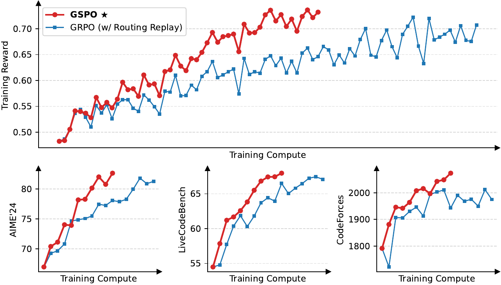
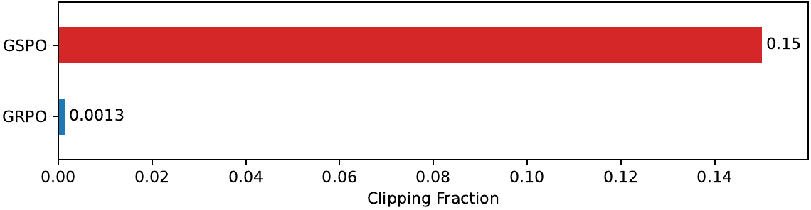
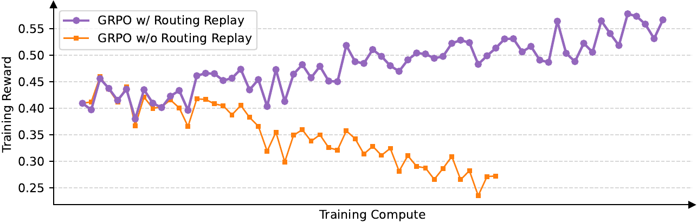

# Group Sequence Policy Optimization（GSPO）

> 论文：**Group Sequence Policy Optimization**  
> 中文：**组序列策略优化**  
> 作者：Chujie Zheng、Shixuan Liu、Mingze Li、Xiong-Hui Chen、Bowen Yu、Chang Gao、Kai Dang、Yuqiong Liu、Rui Men、An Yang、Jingren Zhou、Junyang Lin；Qwen Team，阿里巴巴集团  
> 来源：[arXiv:2507.18071v2](https://arxiv.org/abs/2507.18071v2)  
> 首次提交：2025-07-24；本文翻译对应 v2（2025-07-28 更新）

> **译者说明**：以下内容按论文 v2 全文翻译，公式保留原论文记号。方括号中的“译者注”用于标记术语或论证边界，不改变原文内容。

## 摘要

本文介绍 **Group Sequence Policy Optimization（GSPO，组序列策略优化）**，这是一种用于训练大语言模型的稳定、高效且性能优良的强化学习算法。

不同于以往采用 token-level 重要性比率的算法，GSPO 基于序列似然定义重要性比率，并在序列级别执行裁剪、奖励和优化。我们证明，与 GRPO 算法相比，GSPO 在训练效率和性能上更优，能够显著稳定混合专家（Mixture-of-Experts，MoE）强化学习训练，并有潜力简化 RL 基础设施的设计。这些优点促成了最新 Qwen3 模型的显著改进。

## 1. 引言

强化学习（RL）已经成为扩展语言模型能力的关键范式。通过大规模 RL，语言模型发展出解决竞赛级数学和编程等复杂问题的能力，能够执行更深、更长的推理过程。

要通过增加计算投入成功扩展 RL，首要前提是保持稳定、健壮的训练动态。然而，以 GRPO 为代表的当前最先进 RL 算法，在训练超大规模语言模型时表现出严重的稳定性问题，常常导致灾难性且不可逆的模型崩溃。这种不稳定性阻碍了通过持续 RL 训练进一步提升语言模型能力边界。

在本文中，我们发现 GRPO 的不稳定性源于其算法设计中对重要性采样权重的根本性误用和失效。这会引入高方差训练噪声；随着响应长度增加，噪声逐步累积，并被裁剪机制进一步放大，最终导致模型崩溃。

为解决这些核心限制，我们提出 **Group Sequence Policy Optimization（GSPO）**，一种用于训练大语言模型的新 RL 算法。GSPO 的关键创新是：依据重要性采样的理论基础，基于序列似然定义重要性比率，使其符合重要性采样的基本原则。此外，GSPO 将多个回答的归一化奖励作为 advantage，从而保证序列级奖励与优化粒度保持一致。

实验评估表明，与 GRPO 相比，GSPO 在训练稳定性、效率和性能方面均显著更优。重要的是，GSPO 从机制上解决了大规模 MoE 模型 RL 训练中的稳定性挑战，不再需要复杂的稳定化策略，并显示出简化 RL 基础设施的潜力。这些优点最终促成了最新 Qwen3 模型的出色性能提升。我们希望 GSPO 成为稳健、可扩展的算法基础，推动语言模型大规模 RL 训练持续发展。

## 2. 预备知识

### 2.1 记号

参数为 \(\theta\) 的自回归语言模型定义为策略 \(\pi_\theta\)。用 \(x\) 表示 query，用 \(\mathcal{D}\) 表示 query 集合。给定 query \(x\) 的回答 \(y\)，其在策略 \(\pi_\theta\) 下的似然为：

$$
\pi_\theta(y\mid x)=\prod_{t=1}^{|y|}\pi_\theta(y_t\mid x,y_{<t}),
$$

其中 \(|y|\) 是 \(y\) 中 token 的数量。query-response 对 \((x,y)\) 可以由 verifier \(r\) 打分，得到奖励 \(r(x,y)\in[0,1]\)。

### 2.2 近端策略优化（PPO）

PPO 使用旧策略 \(\pi_{\theta_{\text{old}}}\) 生成的样本，通过裁剪机制将策略更新限制在旧策略附近的近端区域内。具体而言，PPO 使用以下目标进行策略优化（下文为简洁起见省略 KL 正则项，因为它不是本文重点）：

$$
\mathcal{J}_{\text{PPO}}(\theta)=
\mathbb{E}_{x\sim\mathcal{D},\,y\sim\pi_{\theta_{\text{old}}}(\cdot\mid x)}
\left[\frac{1}{|y|}\sum_{t=1}^{|y|}
\min\left(w_t(\theta)\widehat A_t,
\operatorname{clip}(w_t(\theta),1-\varepsilon,1+\varepsilon)\widehat A_t\right)\right].
$$

其中，token \(y_t\) 的重要性比率为：

$$
w_t(\theta)=\frac{\pi_\theta(y_t\mid x,y_{<t})}
{\pi_{\theta_{\text{old}}}(y_t\mid x,y_{<t})},
$$

\(y_t\) 的 advantage \(\widehat A_t\) 由另一个 value model 估计，\(\varepsilon\) 是重要性比率的裁剪范围。

PPO 在实践中的核心挑战是严重依赖 value model。value model 通常与 policy model 规模相近，会带来很大的内存和计算负担。此外，算法效果依赖 value estimate 的可靠性。获得可靠的 value model 本身就很难，而让它扩展到更长响应和更复杂任务则更加困难。

### 2.3 组相对策略优化（GRPO）

GRPO 通过计算同一个 query 的一组回答中每个回答的相对 advantage，绕过对 value model 的需求。具体而言，GRPO 优化以下目标：

$$
\mathcal{J}_{\text{GRPO}}(\theta)=
\mathbb{E}_{x\sim\mathcal{D},\,\{y_i\}_{i=1}^{G}\sim\pi_{\theta_{\text{old}}}(\cdot\mid x)}
\left[\frac{1}{G}\sum_{i=1}^{G}\frac{1}{|y_i|}\sum_{t=1}^{|y_i|}
\min\left(w_{i,t}(\theta)\widehat A_{i,t},
\operatorname{clip}(w_{i,t}(\theta),1-\varepsilon,1+\varepsilon)\widehat A_{i,t}\right)\right].
$$

这里，\(G\) 是每个 query \(x\) 生成的回答数量，即 group size。token \(y_{i,t}\) 的重要性比率和 advantage 分别为：

$$
w_{i,t}(\theta)=\frac{\pi_\theta(y_{i,t}\mid x,y_{i,<t})}
{\pi_{\theta_{\text{old}}}(y_{i,t}\mid x,y_{i,<t})},
$$

$$
\widehat A_{i,t}=\widehat A_i=
\frac{r(x,y_i)-\operatorname{mean}(\{r(x,y_i)\}_{i=1}^{G})}
{\operatorname{std}(\{r(x,y_i)\}_{i=1}^{G})}.
$$

也就是说，\(y_i\) 中的所有 token 共享同一个 advantage \(\widehat A_i\)。

## 3. 动机

模型规模、稀疏性（例如 MoE 模型）和响应长度不断增长，需要更大的 rollout batch size 才能充分利用硬件。为了提高样本效率，通常会把一个大的 rollout batch 划分成多个 mini-batch，执行多次梯度更新。这个过程不可避免地引入 off-policy 学习：响应 \(y\) 来自旧策略 \(\pi_{\theta_{\text{old}}}\)，而不是正在优化的当前策略 \(\pi_\theta\)。这也解释了 PPO 和 GRPO 为什么需要裁剪机制：裁剪可以避免过度 off-policy 的样本参与梯度估计。

尽管裁剪等机制试图处理这种 off-policy 差异，我们在 GRPO 中发现了一个更根本的问题：**它的目标函数定义不适定（ill-posed）**。在使用长响应训练大模型时，这个问题尤其严重，会导致灾难性的模型崩溃。

GRPO 目标不适定的根源是对重要性采样权重的误用。重要性采样的原则是：通过对从行为分布 \(\pi_{\text{beh}}\) 中抽取的样本重新加权，估计目标分布 \(\pi_{\text{tar}}\) 下函数 \(f\) 的期望：

$$
\mathbb{E}_{z\sim\pi_{\text{tar}}}[f(z)]
=\mathbb{E}_{z\sim\pi_{\text{beh}}}
\left[\frac{\pi_{\text{tar}}(z)}{\pi_{\text{beh}}(z)}f(z)\right].
$$

关键在于：需要从行为分布 \(\pi_{\text{beh}}\) 抽取多个样本（\(N\gg1\)），重要性权重 \(\pi_{\text{tar}}(z)/\pi_{\text{beh}}(z)\) 才能有效校正分布不匹配。

相比之下，GRPO 在每个 token 位置 \(t\) 使用：

$$
\frac{\pi_\theta(y_{i,t}\mid x,y_{i,<t})}
{\pi_{\theta_{\text{old}}}(y_{i,t}\mid x,y_{i,<t})}.
$$

由于这个权重只基于从每个 next-token 分布 \(\pi_{\theta_{\text{old}}}(\cdot\mid x,y_{i,<t})\) 中得到的单个样本 \(y_{i,t}\)，它无法发挥预期的分布校正作用。相反，它向训练梯度中引入高方差噪声；噪声会在长序列中累积，并被裁剪机制进一步放大。作者观察到，这可能导致通常不可逆的模型崩溃。一旦发生崩溃，即使恢复到之前的 checkpoint、仔细调整超参数（例如裁剪范围）、延长生成长度或更换 RL query，继续训练也无济于事。

上述现象说明 GRPO 的设计存在根本问题。token-level 重要性权重的失败指向一个核心原则：**优化目标的单位应该与奖励的单位一致**。由于奖励针对整个序列给出，在 token-level 应用 off-policy 校正是有问题的。这促使作者放弃 token-level 目标，转而研究直接在 **sequence level** 使用重要性权重并进行优化。

## 4. 算法

### 4.1 GSPO：组序列策略优化

虽然 GRPO 中的 token-level 重要性权重存在问题，但在语言生成场景下，作者观察到 sequence-level 重要性权重：

$$
\frac{\pi_\theta(y\mid x)}{\pi_{\theta_{\text{old}}}(y\mid x)}
$$

具有明确的理论含义：它反映从旧策略 \(\pi_{\theta_{\text{old}}}(\cdot\mid x)\) 采样的响应 \(y\) 偏离当前策略 \(\pi_\theta(\cdot\mid x)\) 的程度，与 sequence-level reward 自然对齐，也可以作为有意义的裁剪指标。

基于这一观察，作者提出 **GSPO**。GSPO 使用以下 sequence-level 优化目标：

$$
\mathcal{J}_{\text{GSPO}}(\theta)=
\mathbb{E}_{x\sim\mathcal{D},\,\{y_i\}_{i=1}^{G}\sim\pi_{\theta_{\text{old}}}(\cdot\mid x)}
\left[\frac{1}{G}\sum_{i=1}^{G}
\min\left(s_i(\theta)\widehat A_i,
\operatorname{clip}(s_i(\theta),1-\varepsilon,1+\varepsilon)\widehat A_i\right)\right].
$$

这里使用基于 group 的 advantage 估计：

$$
\widehat A_i=
\frac{r(x,y_i)-\operatorname{mean}(\{r(x,y_i)\}_{i=1}^{G})}
{\operatorname{std}(\{r(x,y_i)\}_{i=1}^{G})},
$$

并基于序列似然定义重要性比率：

$$
s_i(\theta)=
\left(\frac{\pi_\theta(y_i\mid x)}
{\pi_{\theta_{\text{old}}}(y_i\mid x)}\right)^{\frac{1}{|y_i|}}
=\exp\left(\frac{1}{|y_i|}\sum_{t=1}^{|y_i|}
\log\frac{\pi_\theta(y_{i,t}\mid x,y_{i,<t})}
{\pi_{\theta_{\text{old}}}(y_{i,t}\mid x,y_{i,<t})}\right).
$$

因此，GSPO 对完整响应进行裁剪，而不是对单个 token 进行裁剪，从梯度估计中排除过度 off-policy 的样本；这同时符合 sequence-level rewarding 和 sequence-level optimization。

需要注意，GSPO 在 \(s_i(\theta)\) 中采用长度归一化，以降低方差，并将 \(s_i(\theta)\) 控制在统一的数值范围内。否则，少数 token 的似然变化就可能导致 sequence-level 重要性比率剧烈波动，不同长度响应的 ratio 还需要使用不同的裁剪范围。作者还指出，由于重要性比率的定义不同，GSPO 与 GRPO 等既有算法的裁剪范围通常会相差一个数量级。

### 4.2 梯度分析

省略裁剪后，GSPO 目标的梯度可以推导为：

$$
\begin{aligned}
\nabla_\theta\mathcal{J}_{\text{GSPO}}(\theta)
=&\ \mathbb{E}\left[\frac{1}{G}\sum_{i=1}^{G}
s_i(\theta)\widehat A_i\nabla_\theta\log s_i(\theta)\right]\\
=&\ \mathbb{E}\left[\frac{1}{G}\sum_{i=1}^{G}
\left(\frac{\pi_\theta(y_i\mid x)}{\pi_{\theta_{\text{old}}}(y_i\mid x)}\right)^{\frac{1}{|y_i|}}
\widehat A_i\frac{1}{|y_i|}\sum_{t=1}^{|y_i|}
\nabla_\theta\log\pi_\theta(y_{i,t}\mid x,y_{i,<t})\right].
\end{aligned}
$$

其中期望的采样分布为 \(x\sim\mathcal{D}\)，\(\{y_i\}_{i=1}^{G}\sim\pi_{\theta_{\text{old}}}(\cdot\mid x)\)。

作为比较，GRPO 目标的梯度为：

$$
\nabla_\theta\mathcal{J}_{\text{GRPO}}(\theta)
=\mathbb{E}\left[\frac{1}{G}\sum_{i=1}^{G}\widehat A_i\frac{1}{|y_i|}
\sum_{t=1}^{|y_i|}
\frac{\pi_\theta(y_{i,t}\mid x,y_{i,<t})}
{\pi_{\theta_{\text{old}}}(y_{i,t}\mid x,y_{i,<t})}
\nabla_\theta\log\pi_\theta(y_{i,t}\mid x,y_{i,<t})\right].
$$

因此，GSPO 与 GRPO 的根本区别在于：**如何对 token 的 log-likelihood 梯度加权**。

在 GRPO 中，token 按各自的 token-level “重要性权重”加权。对于 \(\widehat A_i>0\)，这些不相等的权重可以在 \((0,1+\varepsilon]\) 内变化；对于 \(\widehat A_i<0\)，可以在 \([1-\varepsilon,+\infty)\) 内变化。它们的影响并不可以忽略，可能随着训练推进不断累积并产生不可预测的后果。

相比之下，GSPO 对一个响应中的所有 token 使用相同的响应级权重，从而消除了 GRPO 的这个不稳定因素。

### 4.3 GSPO-token：token-level 目标变体

在多轮 RL 等场景中，可能需要比 sequence level 更细粒度的 advantage 调整。为此，作者引入 GSPO 的 token-level 目标变体 **GSPO-token**，允许逐 token 定制 advantage：

$$
\mathcal{J}_{\text{GSPO-token}}(\theta)=
\mathbb{E}\left[\frac{1}{G}\sum_{i=1}^{G}\frac{1}{|y_i|}\sum_{t=1}^{|y_i|}
\min\left(s_{i,t}(\theta)\widehat A_{i,t},
\operatorname{clip}(s_{i,t}(\theta),1-\varepsilon,1+\varepsilon)\widehat A_{i,t}\right)\right].
$$

其中：

$$
s_{i,t}(\theta)=\operatorname{sg}[s_i(\theta)]\cdot
\frac{\pi_\theta(y_{i,t}\mid x,y_{i,<t})}
{\operatorname{sg}[\pi_\theta(y_{i,t}\mid x,y_{i,<t})]}.
$$

\(\operatorname{sg}[\cdot]\) 表示只取数值并停止梯度，对应 PyTorch 中的 `detach` 操作。

GSPO-token 的梯度为：

$$
\begin{aligned}
\nabla_\theta\mathcal{J}_{\text{GSPO-token}}(\theta)
=\mathbb{E}\left[\frac{1}{G}\sum_{i=1}^{G}s_i(\theta)\frac{1}{|y_i|}
\sum_{t=1}^{|y_i|}\widehat A_{i,t}
\frac{\nabla_\theta\pi_\theta(y_{i,t}\mid x,y_{i,<t})}
{\pi_\theta(y_{i,t}\mid x,y_{i,<t})}\right]\\
=\mathbb{E}\left[\frac{1}{G}\sum_{i=1}^{G}
\left(\frac{\pi_\theta(y_i\mid x)}{\pi_{\theta_{\text{old}}}(y_i\mid x)}\right)^{\frac{1}{|y_i|}}
\frac{1}{|y_i|}\sum_{t=1}^{|y_i|}\widehat A_{i,t}
\nabla_\theta\log\pi_\theta(y_{i,t}\mid x,y_{i,<t})\right].
\end{aligned}
$$

注意，

$$
\frac{\pi_\theta(y_{i,t}\mid x,y_{i,<t})}
{\operatorname{sg}[\pi_\theta(y_{i,t}\mid x,y_{i,<t})]}
$$

在数值上等于 1，因此 \(s_{i,t}(\theta)\) 在数值上等于 \(s_i(\theta)\)。比较 GSPO 与 GSPO-token 的目标和梯度可知：当响应 \(y_i\) 中所有 token 的 advantage 相同（即 \(\widehat A_{i,t}=\widehat A_i\)）时，两者在优化目标、裁剪条件和理论梯度上数值完全相同；GSPO-token 的优势是可以更灵活地逐 token 调整 advantage。

## 5. 实验与讨论

### 5.1 实验结果

作者使用从 Qwen3-30B-A3B-Base 冷启动微调得到的模型进行实验，并报告训练 reward 曲线，以及 AIME'24（32 次采样的平均 Pass@1）、LiveCodeBench（202410-202502，8 次采样的平均 Pass@1）和 CodeForces（Elo Rating）上的模型性能曲线。

RL 训练期间，每个 rollout data batch 被划分为四个 mini-batch，用于梯度更新。GSPO 在公式中的左、右裁剪范围分别设为 `3e-4` 和 `4e-4`。作为基线，GRPO 的左、右裁剪范围分别设为 `0.2` 和 `0.27`；作者对其进行了仔细调参，以保证公平比较。

需要注意，GRPO 需要 **Routing Replay** 训练策略才能使 MoE RL 正常收敛，论文将在后文进一步讨论；而 **GSPO 不需要该策略**。

图 1 展示了 GSPO 训练过程始终稳定。作者观察到，GSPO 可以通过增加训练计算量、定期更新 query 集和延长生成长度，持续提升性能。此外，与 GRPO 相比，GSPO 训练效率更高：在相同训练计算量和消耗的 query 数量下，GSPO 获得了更好的训练准确率和基准性能。最后，作者已成功将 GSPO 应用于最新 Qwen3 模型的 RL 训练，充分证明 GSPO 能够释放大语言模型 RL scaling 的潜力。

### 5.2 关于裁剪比例的有趣观察

GSPO 与 GRPO 的一个关键区别是：GSPO 裁剪完整响应，而不是单个 token。特别是，如图 2 所示，作者观察到 GSPO 与 GRPO 的被裁剪 token 比例相差两个数量级；即使调整裁剪范围，这种数量级差异也不会改变。

然而，尽管 GSPO 裁剪了更多 token、实际用于训练或梯度估计的 token 更少，GSPO 仍然比 GRPO 获得了更高的训练效率。这一反直觉现象——裁剪更多 token 却带来更高训练效率——进一步说明 GRPO 的 token-level 梯度估计本身具有噪声且样本利用效率低。相比之下，GSPO 的 sequence-level 方法提供了更可靠、更有效的学习信号。

### 5.3 GSPO 对 MoE 训练的好处

#### 背景

与 dense 模型的 RL 训练相比，MoE 模型的稀疏激活特性带来了独特的稳定性挑战。作者特别发现，采用 GRPO 时，MoE 模型的**专家激活波动（expert-activation volatility）**会阻止 RL 训练正常收敛。

具体而言，经过一次或多次梯度更新后，同一个响应所激活的专家可能发生显著变化。例如，对于 48 层 Qwen3-30B-A3B-Base 模型，在每次 RL 梯度更新后、针对同一个 rollout 样本，新策略 \(\pi_\theta\) 激活的专家中大约有 10% 不同于旧策略 \(\pi_{\theta_{\text{old}}}\) 激活的专家。这个现象在更深的 MoE 模型中更加明显，会使 token-level 重要性比率剧烈波动并进一步失效，从而阻碍 RL 训练正常收敛。

#### 以往方法：Routing Replay

为解决这一挑战，作者此前采用 **Routing Replay** 训练策略。具体而言，缓存旧策略 \(\pi_{\theta_{\text{old}}}\) 激活的专家，并在计算 token-level 重要性比率时，让新策略 \(\pi_\theta\) “重放”这些路由模式。

这样，对于每个 token \(y_{i,t}\)，\(\pi_\theta(y_{i,t}\mid x,y_{i,<t})\) 与 \(\pi_{\theta_{\text{old}}}(y_{i,t}\mid x,y_{i,<t})\) 使用相同的激活网络，因此可以恢复 token-level 重要性比率的稳定性，并保证在多次梯度更新中优化同一个一致的激活网络。图 3 表明，Routing Replay 是 MoE 模型 GRPO 训练正常收敛所必需的技术。

#### GSPO 的好处

尽管 Routing Replay 可以使 MoE RL 训练正常收敛，但重复使用路由模式会带来额外的内存和通信开销，也可能限制 MoE 模型的实际容量。

相比之下，如图 1 所示，GSPO 消除了对 Routing Replay 的依赖，可以按通常方式计算 sequence-level 重要性比率 \(s_i(\theta)\)，正常收敛并稳定优化。

关键洞见是：GSPO 只关注序列似然 \(\pi_\theta(y_i\mid x)\)，而不敏感于单个 token 的似然 \(\pi_\theta(y_{i,t}\mid x,y_{i,<t})\)。由于 MoE 模型始终保持语言建模能力，序列似然不会发生剧烈波动。

总之，GSPO 从根本上解决了 MoE 模型中的专家激活波动问题，不再需要 Routing Replay 这类复杂的变通方案。这不仅简化并稳定了训练过程，也允许模型利用其完整容量，而不受人为限制。

### 5.4 GSPO 对 RL 基础设施的好处

由于训练引擎（例如 Megatron）与推理引擎（例如 SGLang、vLLM）之间存在精度差异，实践中通常使用训练引擎重新计算采样响应在旧策略 \(\pi_{\theta_{\text{old}}}\) 下的似然。

然而，GSPO 只使用 sequence-level 似然，而不是 token-level 似然进行优化；直观上，前者对精度差异的容忍度更高。因此，GSPO 允许直接使用推理引擎返回的似然进行优化，避免训练引擎重新计算。这在 partial rollout、多轮 RL 以及训练与推理分离的框架中尤其有益。

## 6. 结论

本文提出了用于训练大语言模型的新强化学习算法 **Group Sequence Policy Optimization（GSPO）**。遵循重要性采样的基本原则，GSPO 基于序列似然定义重要性比率，并在序列级别执行裁剪、奖励和优化。

与 GRPO 相比，GSPO 展现出更优的训练稳定性、效率和性能；对于 MoE 模型的大规模 RL 训练尤其有效，为最新 Qwen3 模型的显著改进奠定了基础。GSPO 作为可扩展的算法基石，能够支持继续扩展 RL，作者期待由此带来智能能力上的根本性进步。

## 参考文献

1. DeepSeek-AI. *DeepSeek-R1: Incentivizing Reasoning Capability in LLMs via Reinforcement Learning*. arXiv:2501.12948, 2025。
2. MiniMax. *MiniMax-M1: Scaling Test-Time Compute Efficiently with Lightning Attention*. arXiv:2506.13585, 2025。
3. OpenAI. *Learning to Reason with LLMs*, 2024。
4. Qwen Team. *Qwen3 Technical Report*. arXiv:2505.09388, 2025。
5. Qwen Team. *QwQ-32B: Embracing the Power of Reinforcement Learning*, 2025。
6. John Schulman et al. *Proximal Policy Optimization Algorithms*. arXiv:1707.06347, 2017。
7. Zhihong Shao et al. *DeepSeekMath: Pushing the Limits of Mathematical Reasoning in Open Language Models*. arXiv:2402.03300, 2024。
8. Chujie Zheng et al. *CLICK: Controllable Text Generation with Sequence Likelihood Contrastive Learning*. Findings of ACL 2023。

## 译者补充：与 GRPO 的最小差异

| 维度 | GRPO | GSPO |
|---|---|---|
| importance ratio | token-level \(w_{i,t}\) | sequence-level \(s_i\)，并做长度归一化 |
| clipping 粒度 | 每个 token | 整条 response |
| reward/advantage | group-level reward，token 共享 advantage | group-level reward，sequence 直接优化 |
| 长序列影响 | token ratio 的高方差可能沿序列累积 | 响应级 ratio，所有 token 共享同一序列权重 |
| MoE 路由 | 论文实验中需要 Routing Replay 才能稳定 | 论文声称无需 Routing Replay |
| token-level advantage | 原始 GRPO 以 response advantage 广播到 token | GSPO-token 支持逐 token advantage，且可保持 sequence ratio |

> 这里的 GSPO 不是 DAPO 的同义词：DAPO 主要通过 Clip-Higher、Dynamic Sampling、Token-Level Loss 和 Overlong Reward Shaping 改进 GRPO；GSPO 则改变 importance ratio、clipping 与优化的粒度，从 token-level 转向 sequence-level。

