# AsyncFlow：高效大语言模型后训练的异步流式强化学习框架

> 论文全文中文翻译（对应 arXiv v1，2025-07-02）  
> 原文：<https://arxiv.org/abs/2507.01663>  
> 说明：仅翻译论文内容；代码、公式、专有名词和引用键尽量保留原貌。方括号中的“译者注”用于标记原文歧义或需要核对的表述。

## 摘要

强化学习（RL）已经成为大语言模型（LLM）后训练的关键技术。现有 RL 系统一般采用两种架构：任务共置（task-colocated）和任务分离（task-separated）。任务共置架构将多个 RL 任务放在同一组设备上，容易造成显存利用率低、重新分片开销大以及并行度受限；任务分离架构把不同任务放到不同设备组，虽然资源利用率更高，却因为任务间的数据依赖产生流水线气泡，并且嵌套并行使系统实现复杂。

本文提出 **AsyncFlow**，一个面向高效 LLM 后训练的异步流式 RL 框架。AsyncFlow 的核心是 TransferQueue：一种分布式数据管理与传输组件，提供异步流式数据加载器，使下游任务可以在数据逐步生成时立即消费。基于 TransferQueue，我们构建了生产者—消费者式的异步工作流，通过延迟参数更新减少任务间等待；同时，框架提供面向服务的接口，将算法逻辑与底层训练/推理引擎解耦。

在华为昇腾 NPU 集群上的实验表明，相比任务共置的基线，AsyncFlow 平均吞吐提升 **1.59 倍**，最高提升 **2.03 倍**，并且能够在不同规模的集群上保持良好的扩展性。

## 1. 引言

预训练数据规模增长逐渐受到限制，研究者开始更多依赖后训练来提升 LLM 的推理能力。强化学习（尤其是 RLHF）通过让模型生成回答、计算奖励并更新策略，已经成为后训练的标准方法。

一个典型的 RL 后训练迭代包含六类任务：

1. Actor rollout：策略模型生成回答；
2. Reference inference：参考模型计算参考策略的 log-probability；
3. Critic inference：价值模型计算 value；
4. Reward inference：奖励模型或规则函数计算奖励；
5. Actor update：根据优势函数更新策略；
6. Critic update：更新价值模型。

任务共置架构把上述任务放到相同设备上。由于训练和推理阶段需要不同的并行方式，模型经常在两种分片之间切换，导致显存浪费和重新分片开销。不同任务的计算负载和序列长度也不均衡，使设备无法持续满载。

任务分离架构把训练、推理和奖励任务放到独立设备组，可以分别优化资源配置，但它要求跨任务传输大量中间数据。后续任务必须等待前置任务完成，产生显著的 pipeline bubble；为掩盖这些等待而引入的嵌套并行又增加了编程和调度复杂度。

现有开源框架通常与特定训练或推理引擎深度耦合，难以复用新的后端。AsyncFlow 针对这些问题作出四点设计：

- **分布式数据管理**：TransferQueue 将数据平面和控制平面分离，统一管理跨任务样本及其状态。
- **异步流式工作流**：数据以微批次为粒度流动，生产者和消费者可以重叠执行。
- **异步参数更新**：允许推理任务在短时间内使用旧参数，隐藏权重同步和加载开销。
- **服务化接口**：用统一 API 连接算法、训练引擎和推理引擎。

本文贡献如下：

1. 提出支持分布式存储、异步传输和集中式状态管理的 TransferQueue；
2. 设计生产者—消费者式异步 RL 工作流，减少跨任务流水线气泡；
3. 提供与底层引擎无关的服务化用户接口；
4. 在多种模型和集群规模上验证最高 2.03 倍的吞吐提升。

## 2. 系统概览

AsyncFlow 采用分层架构（图 1）。

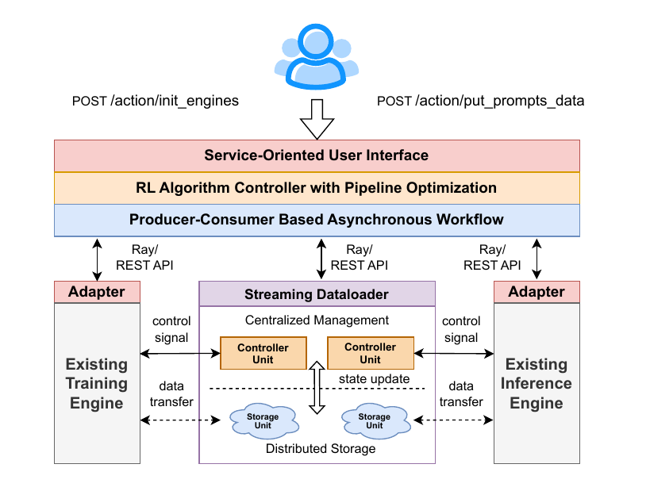

*图 1：AsyncFlow 系统概览。资源层负责设备，后端层适配训练/推理引擎，优化层实现 TransferQueue 和异步工作流，接口层向用户暴露统一 API。*

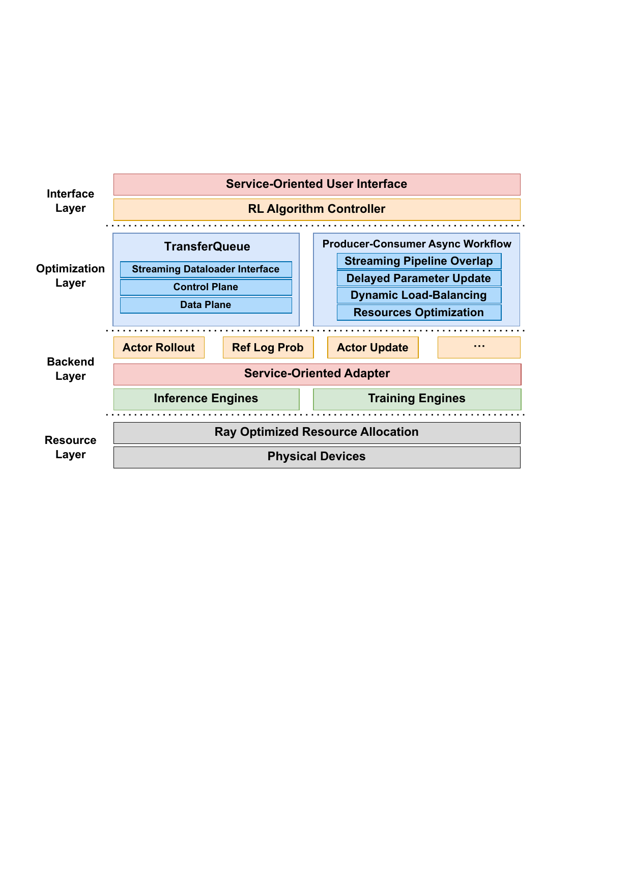

*图 2：AsyncFlow 的资源层、后端层、优化层和接口层。*

### 2.1 资源层

资源层基于 Ray 管理计算资源。框架在运行前使用执行时间模拟器预估不同任务配置的代价，搜索满足资源约束的设备分配和并行策略，从而避免运行时频繁调整。

### 2.2 后端层

后端层以模块化适配器连接不同的训练和推理引擎。训练侧可以使用 PyTorch FSDP、DeepSpeed 或 MindSpeed，推理侧可以使用 vLLM 等引擎。上层算法不需要了解具体引擎的调用细节。

### 2.3 优化层

优化层由 TransferQueue 和生产者—消费者异步工作流组成。TransferQueue 负责样本的分布式存储、元数据通知和微批次组装；工作流负责让 rollout、奖励计算、log-prob 计算和参数更新重叠执行。

### 2.4 接口层

接口层提供统一的算法入口和服务 API。用户只需描述需要哪些数据列、每次消费多少样本以及如何生成或处理样本，框架即可完成跨任务的数据传递和状态管理。

## 3. TransferQueue：高性能异步流式数据加载器

### 3.1 架构概览

传统做法通常先将完整 batch 从一个任务传给下一个任务，消费者必须等待生产者生成整个 batch。TransferQueue 将样本拆成可独立传输的行，并为每个数据列记录状态。下游任务可以在所需列准备好后立即读取部分样本，因此计算和传输能够重叠。

TransferQueue 将数据平面与控制平面解耦，这一思想借鉴了软件定义网络（SDN）：

- 数据平面由多个分布式存储单元组成，保存样本内容；
- 控制平面由多个任务控制器组成，维护元数据、选择可消费样本并记录消费状态；
- 生产者写入样本后，通知相应控制器；消费者向控制器请求元数据，再从存储单元读取内容。

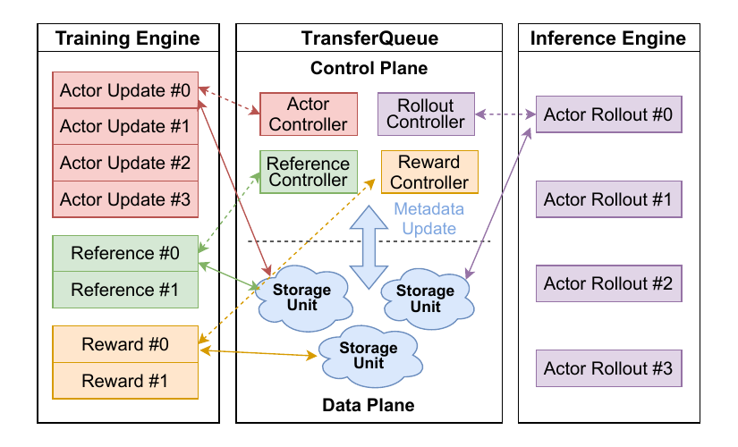

*图 2：TransferQueue 的控制平面、数据平面和任务控制器。*

每个 RL 任务拥有一个专用控制器。元数据包含样本所在的存储位置、数据状态和消费状态。存储单元只保存全局索引空间中的一部分行；写入操作完成后向控制器发送通知。

### 3.2 数据平面：分布式传输与存储

#### 3.2.1 数据结构

TransferQueue 使用二维列式结构：列表示 prompts、responses、log-prob、rewards 等任务相关组件，行表示一个完整样本，并带有全局索引。消费者只请求所需列，避免传输无关数据。

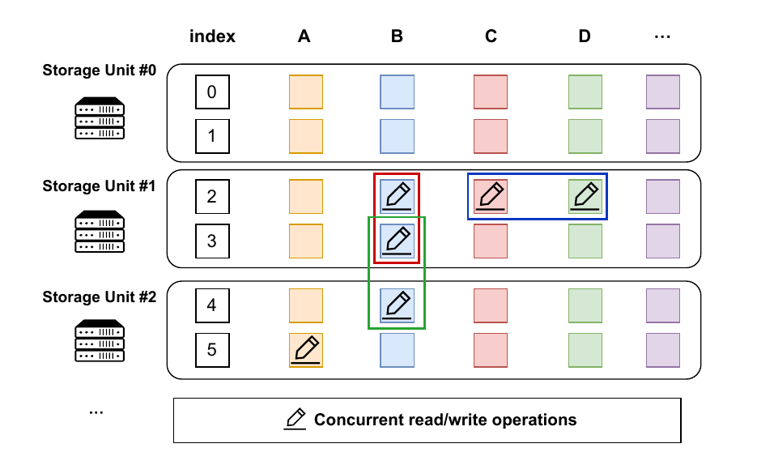

*图 3：二维列式数据结构。每一行由全局索引标识，每一列对应一种样本组件。*

#### 3.2.2 元数据通知

生产者写入数据后，通知消息只携带行索引和列 ID，而不携带样本本身。控制器据此更新全局状态。通知机制减少了控制消息大小，并允许多个消费者并行获取不同列。

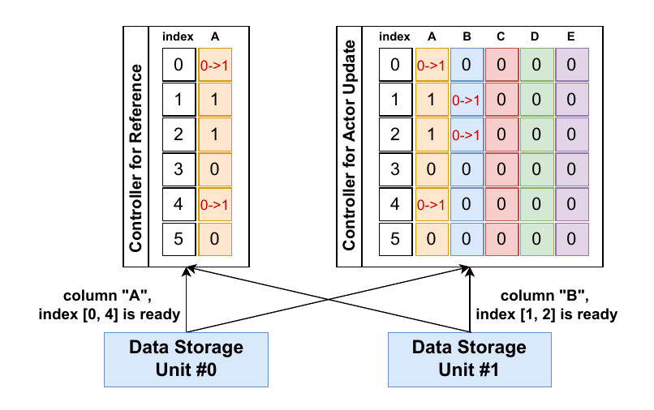

*图 4：生产者、控制器和存储单元之间的元数据通知。*

### 3.3 控制平面：集中式数据视图

控制器扫描元数据表，寻找“所有必需列均已就绪且尚未被消费”的行，然后按照负载均衡策略组装微批次并将这些行标记为已消费。不同速度的消费者可以请求不同数量的样本；较快的实例会自动获得更多数据。对于变长序列，控制器还可以依据 token 数而不是样本数进行主动均衡。

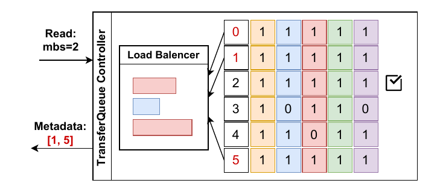

*图 5：控制器选择已就绪且未消费的行，并组装消费者微批次。*

### 3.4 交互接口

TransferQueue 对外封装为 PyTorch `DataLoader`。任务只需要指定：

- `experience_consumer_stage`：当前消费者任务；
- `experience_columns`：需要读取的数据列；
- `experience_count`：一次请求的样本数；
- 并行度相关的 padding 配置。

示例（代码逻辑保持原文，注释译为中文）：

```python
# 在 RolloutWorker(BaseWorker) 中
def generate_sequences(self):
    # 定义数据列并初始化 TransferQueue
    experience_consumer_stage = 'actor_rollout'
    experience_columns = ['prompts', 'prompt_length']
    experience_count = self.rl_config.rollout_dispatch_size

    data_loader = self.create_stream_data_loader(
        experience_consumer_stage=experience_consumer_stage,
        experience_columns=experience_columns,
        experience_count=experience_count,
        use_vllm=True,
        pad_to_multiple_of=self.generate_config.infer_tensor_parallel_size,
    )
    data_iter = iter(data_loader)

    for batch_data, index in data_iter:
        # 执行推理
        prompts_data = batch_data['prompts']
        responses = self.rollout.generate_sequences(prompts_data)
        # 将生成的回答写入 TransferQueue
        self.collect_transfer_queue_data(responses, index)
```

### 3.5 高并发设计

当并发消费者数量增加时，可以扩展存储单元以提升带宽。控制器将调度和 I/O 并发执行；每个数据并行组只由一个 rank 访问 TransferQueue，然后在组内广播元数据。变长数据采用“长度元数据 + 拼接缓冲区”的方式传输，避免 padding 浪费；在昇腾设备上使用 HCCL 完成拼接和恢复。

## 4. 基于生产者—消费者的异步工作流优化

任务分离架构的主要问题是流水线气泡。AsyncFlow 使用三种互补优化：跨任务流式重叠、允许一步延迟的参数更新，以及主动资源规划和动态负载均衡。

### 4.1 跨 RL 任务的流式流水线重叠

TransferQueue 将完整 batch 的依赖细化为微批次依赖。rollout 生成第一个微批次后，奖励任务即可开始处理；rollout 同时继续生成后续微批次。所有 RL 任务通过 TransferQueue 连接，无需用户手动重新调度数据流。

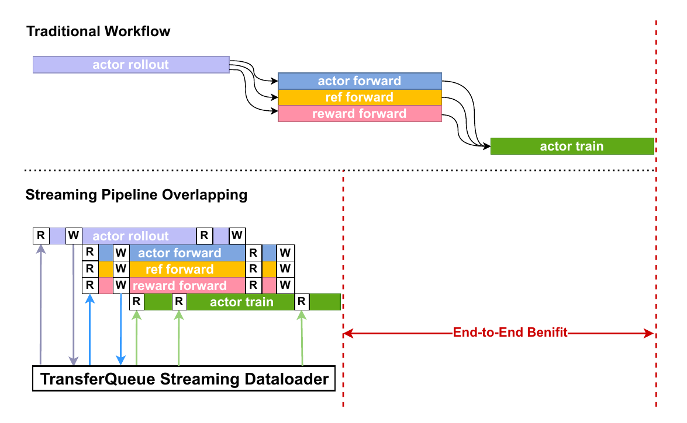

*图 6：以微批次为粒度的流式流水线，使生产和消费重叠。*

### 4.2 异步 off-policy 气泡消除

#### 4.2.1 基本异步 RL 算法

严格 on-policy 的 RL 迭代包含 warm-up 和 cool-down 阶段：rollout 必须等待新策略参数，训练也必须等待一批完整经验。扩大全局 rollout batch 可以容纳短时间的旧策略数据，从而让任务持续运行。实验观察到，一步异步（使用前一版本参数生成的数据）通常不会造成明显性能下降；异步程度超过一步后，性能会近似按对数形式下降。[译者注：原文未给出该经验规律的严格定义和拟合区间。]

#### 4.2.2 延迟参数更新机制

Actor 更新完成后，rollout worker 不立即停止，而是继续使用旧权重完成当前生成迭代。新参数先异步写入主机内存，等当前迭代结束后再加载到昇腾 NPU。这样，参数同步的可见开销主要变成主机到设备（H2D）传输，并被下一轮生成隐藏。稳定阶段可以持续很长时间，近似不受单次权重更新阻塞。

该设计与 StreamRL 的延迟更新思想相似，但 AsyncFlow 通过 TransferQueue 将重叠扩展到全部 RL 任务，而不只覆盖 rollout 与训练。

#### 4.2.3 参数更新重叠

参数更新模块由训练集群上的 `WeightSender` 和推理集群上的 `WeightReceiver` 组成。同步模式使用 HCCL 直接传输；异步模式先将权重卸载到主机，再通过主机网络异步发送，计算线程不被通信阻塞。

在拥有充足 rollout 设备时，还可以采用 sub-step asynchronous：不同推理实例错开更新时间，一部分实例继续服务下游任务，另一部分实例加载最新参数。这样同一批数据中既有新参数样本，也有旧参数样本，并且可以进一步隐藏 checkpoint 加载开销。论文将该实现留作后续工作。

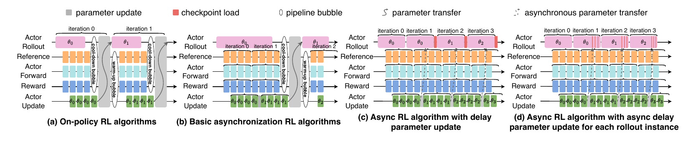

*图 7：同步流水线与一步异步流水线的执行阶段对比。*

### 4.3 任务资源规划

AsyncFlow 使用基于图的资源规划模块，将 RL 工作流表示为任务图，在资源约束下搜索最优的设备数量、并行配置和任务放置。代价模型结合解析估计与运行时 profiling：解析部分估计通信、计算和数据依赖，profiling 部分校准不同模型、序列长度和设备规模下的实际耗时。

## 5. 面向服务的用户接口

AsyncFlow 的接口分为用户层和后端层。用户层集中表达算法逻辑；后端层通过 Adapter 抽象屏蔽不同训练/推理引擎的执行细节。

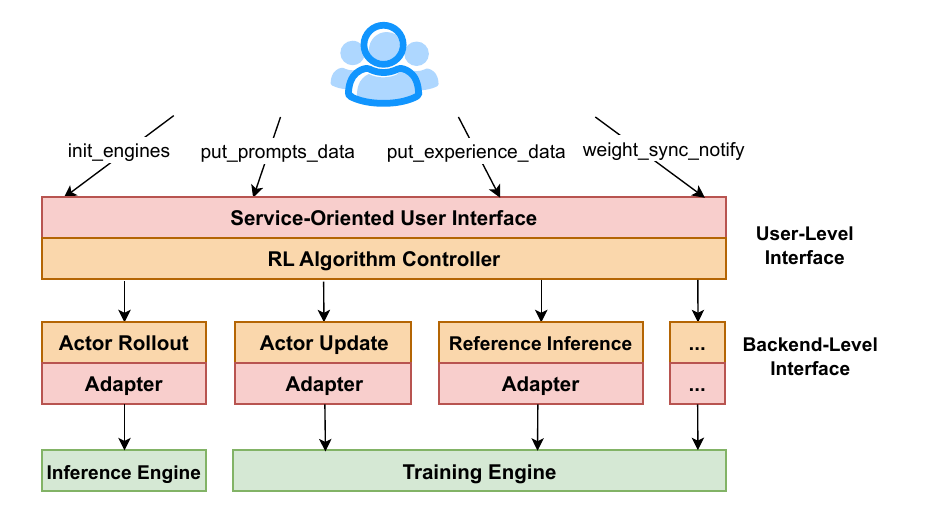

*图 8：用户层 Trainer 与训练、推理后端适配器之间的关系。*

### 5.1 用户层接口

`Trainer` 是算法控制器，负责初始化引擎、驱动生成和更新，并调用 TransferQueue 完成数据交换。主要 API 包括：

- `init_engines`：初始化训练和推理引擎；
- `put_prompts_data`：写入 prompt 数据；
- `put_experience_data`：写入生成的经验数据；
- `get_experience_data`：按数据列和数量读取经验；
- `weight_sync_notify`：通知推理侧有新权重可用。

### 5.2 后端层接口

后端适配器为每种执行引擎实现统一方法。示例中的 MindSpeed 适配器将 `compute_log_prob` 映射到底层的 `forward_backward_func`；VLLM 适配器则提供对应的推理调用。

```python
# 基础适配器
class RLAdapter:
    pass

class MindSpeedAdapter(RLAdapter):
    def __init__(self, forward_backward_func, model, batches, forward_step):
        self.forward_backward_func = forward_backward_func
        self.forward_step = forward_step
        self.model = model
        self.batches = batches
        ...

    # RL 任务抽象：计算 log-prob
    def compute_log_prob(self):
        ...
        losses_reduced = self.forward_backward_func(
        forward_step_func=self.forward_step,
        data_iterator=iter(self.batches),
        model=self.model,
        micro_batch_size=self.micro_batch_size,
        forward_only=True,
        collect_non_loss_data=True,
        )
        ...

class VLLMAdapter(RLAdapter):
    pass
```

## 6. 实验评估

### 6.1 实验设置

- **模型**：Qwen2.5-7B 至 Qwen2.5-32B。
- **算法**：GRPO（不需要 critic）；PPO 在论文版本中仍在开发。[译者注：本文实验没有集成 DAPO，不能据此推断 AsyncFlow 已实现 DAPO 的全部动态采样机制。]
- **数据集**：DeepScaleR，超过 4 万个数学问答—解答样本。
- **硬件**：华为昇腾 NPU 集群，每节点 16 个 NPU，节点系统内存总量 2880 GB。
- **软件**：Ascend Extension for PyTorch 7.0.0（PyTorch 2.5.1）、CANN 8.1.RC1、vLLM-Ascend 0.7.3，以及 MindSpeed 后端。
- **基线**：verl 的任务共置架构和 3D-HybridEngine；另以 PyTorch FSDP + vLLM-Ascend 作为任务分离实现。verl 使用 2025-04-07 的提交 `d13434f`。

### 6.2 总体性能

实验覆盖 32 至 1024 个 NPU，以及 Qwen2.5-7B 和 32B。相较基线，AsyncFlow 平均吞吐提升 1.59 倍，Qwen2.5-7B 在 256 个 NPU 上最高达到 2.03 倍。在 512 个 NPU 上，7B 和 32B 模型分别达到 1.76 倍和 1.82 倍；在 32 个 NPU 上，7B 模型吞吐提升 33.4%。集群规模扩大 16 倍时，两个模型的扩展线性度分别为 0.65 和 0.88。

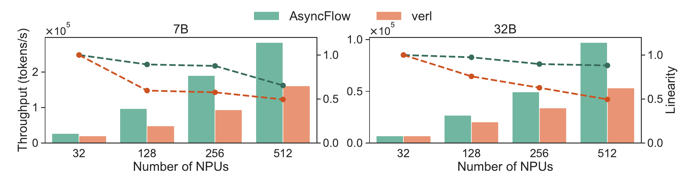

*图 9：不同模型规模和 NPU 数量下的吞吐对比。*

### 6.3 消融实验

在 7B 模型、512 个 NPU 上进行消融，基线吞吐归一化为 1：

| 配置 | 归一化吞吐 |
|---|---:|
| 基线 | 1.00 |
| 基线 + TransferQueue | 2.01 |
| 基线 + TransferQueue + 异步优化 | 2.74 |

在 TransferQueue 基础上加入异步优化后，吞吐进一步提升 36.3%。

### 6.4 AsyncFlow 的优化工作流

工作流甘特图显示，TransferQueue 使各任务可以按微批次交错执行，任务间空闲时间接近最小；延迟参数更新则隐藏了权重传输和加载阶段。

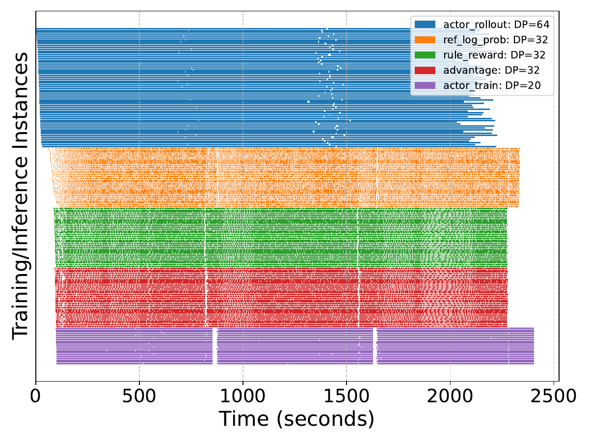

*图 10：AsyncFlow 在实际运行中的任务重叠。*

### 6.5 异步 RL 算法的稳定性

在 7B 模型、16 个 NPU 上比较开启和关闭异步优化的训练过程。在相同墙钟时间内，两种配置的奖励曲线没有显著差异；回答长度的方差也逐步收敛，说明一步异步不会明显破坏训练稳定性。

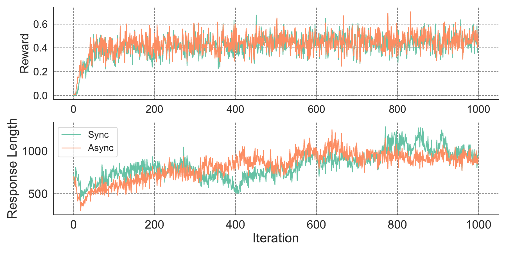

*图 11：异步与同步训练的奖励和回答长度变化。*

## 7. 相关工作

### 7.1 LLM 后训练框架

后训练框架可以分为任务共置和任务分离两类。TRL、DeepSpeed-Chat、NeMo-Aligner、RLHFuse 和早期 verl 主要采用任务共置方式；OpenRLHF、k1.5、Seed1.5-Thinking、StreamRL 和 AReaL 等工作探索了任务分离或异步流水线。

### 7.2 RLHF 算法

PPO 是 RLHF 的基础算法，通过 actor、critic、reference 和 reward 模型共同训练。GRPO 去掉独立的 critic，使用同一 prompt 下多条回答的相对奖励估计优势，从而减少显存和计算开销。论文在此处将 DAPO 描述为通过“动态参考策略（dynamic reference strategy）”移除 reference model。[译者注：这是本文 Related Work 的原文表述；DAPO 的正式机制请以 DAPO 原论文为准，不能把此句直接当作 DAPO 的完整定义。]

### 7.3 LLM 后训练系统优化

RLHFuse 通过融合任务减少中间张量传输；StreamRL 使用回答长度预测器改善资源配置；k1.5 探索 partial rollout，在生成未完成时便开始后续处理。AsyncFlow 的区别在于：它用通用 TransferQueue 统一承载所有任务间的数据流，并在此基础上实现跨任务的生产者—消费者异步执行。

## 8. 结论

本文提出 AsyncFlow，一个面向 LLM 后训练的任务分离式异步流式 RL 框架。TransferQueue 提供分布式数据存储、元数据管理和异步流式加载；生产者—消费者工作流使不同 RL 任务可以按微批次重叠；延迟参数更新进一步隐藏了权重同步气泡；服务化接口则解耦算法与底层训练/推理引擎。

实验显示，AsyncFlow 在不同模型和集群规模下均能提升吞吐，最高达到基线的 2.03 倍。未来工作将进一步错开不同推理实例的更新时间，实现低于一个训练 step 的 sub-step 异步，并研究其对训练稳定性和最终效果的影响。

## 附录：图表文件

本译文使用的图表已转换为 PNG，并保存在同目录的 `asyncflow_figures/` 文件夹中。论文源代码中的示例文件为 `tq_example.py` 和 `backend_interface.py`；译文保留了代码结构，仅翻译注释。

## 参考文献

本文参考文献沿用论文 `main.bbl` 中的原始条目和引用顺序。为避免改变论文的书目信息，作者、会议、年份和 DOI 等字段保留原文；题目给出中文翻译，括号内保留英文原题。

1. Devlin 等（2019），《用于语言理解的深度双向 Transformer 预训练》（BERT: Pre-training of Deep Bidirectional Transformers for Language Understanding），NAACL-HLT。
2. Fu 等（2025），《AReaL：面向语言推理的大规模异步强化学习系统》（AReaL: A Large-Scale Asynchronous Reinforcement Learning System for Language Reasoning），arXiv:2505.24298。
3. Grattafiori 等（2024），《Llama 3 模型家族》（The Llama 3 Herd of Models），arXiv:2407.21783。
4. Guo 等（2025），《DeepSeek-R1：通过强化学习激励大语言模型的推理能力》（DeepSeek-R1: Incentivizing Reasoning Capability in LLMs via Reinforcement Learning），arXiv:2501.12948。
5. Hu 等（2024），《OpenRLHF：易用、可扩展、高性能的 RLHF 框架》（OpenRLHF: An Easy-to-Use, Scalable and High-Performance RLHF Framework），arXiv:2405.11143。
6. Huawei（2025），MindSpeed-RL。
7. Kaplan 等（2020），《神经语言模型的扩展定律》（Scaling Laws for Neural Language Models），arXiv:2001.08361。
8. Kwon 等（2023），《使用 PagedAttention 高效管理大语言模型服务的内存》（Efficient Memory Management for Large Language Model Serving with PagedAttention），SOSP。
9. Liu 等（2024），《DeepSeek-V3 技术报告》（DeepSeek-V3 Technical Report），arXiv:2412.19437。
10. Luo 等（2025），《DeepScaleR：通过扩展强化学习，用 1.5B 模型超越 O1-Preview》（DeepScaleR: Surpassing O1-Preview with a 1.5B Model by Scaling RL）。
11. Moritz 等（2018），《Ray：面向新兴 AI 应用的分布式框架》（Ray: A Distributed Framework for Emerging AI Applications），OSDI。
12. Muennighoff 等（2023），《受数据约束的语言模型扩展》（Scaling Data-Constrained Language Models），NeurIPS。
13. Noukhovitch 等（2024），《异步 RLHF：更快、更高效的语言模型离策略强化学习》（Asynchronous RLHF: Faster and More Efficient Off-Policy RL for Language Models），arXiv:2410.18252。
14. NVIDIA（2024），Data Flywheel。
15. NVIDIA（2024），TensorRT-LLM。
16. OpenAI（2024），《学习让大语言模型进行推理》（Learning to Reason with LLMs）。
17. Ouyang 等（2022），《训练语言模型遵循人类指令》（Training Language Models to Follow Instructions with Human Feedback），NeurIPS。
18. Qin 等（2025），《Mooncake：用更多存储换取更少计算的 KVCache 池化系统》（Mooncake: Trading More Storage for Less Computation with a KVCache-Centric Architecture）。
19. Radford 等（2018），《通过生成式预训练提升语言理解》（Improving Language Understanding by Generative Pre-Training）。
20. Ramesh 等（2024），《无奖励模型的群体鲁棒偏好优化》（Group Robust Preference Optimization in Reward-Free Settings）。
21. Rasley 等（2020），《DeepSpeed：系统优化支持大规模深度学习训练》（DeepSpeed: System Optimizations Enable Training）。
22. Redis（2025），Redis。
23. Schulman 等（2017），《近端策略优化算法》（Proximal Policy Optimization Algorithms）。
24. Seed 等（2025），《Seed1.5-Thinking：推进卓越推理模型》（Seed1.5-Thinking: Advancing Superb Reasoning Models）。
25. SemiAnalysis（2024），《扩展定律——O1 Pro 架构、推理与训练》（Scaling Laws – O1 Pro Architecture, Reasoning and Training）。
26. Shen 等（2024），《NeMo-Aligner：高效大规模语言模型对齐工具包》（NeMo-Aligner: Scalable Toolkit for Efficient Model Alignment）。
27. Sheng 等（2024），《HybridFlow：灵活高效的 RLHF 框架》（HybridFlow: A Flexible and Efficient RLHF Framework）。
28. Shoeybi 等（2019），《Megatron-LM：训练多十亿参数语言模型》（Megatron-LM: Training Multi-Billion Parameter Language Models）。
29. Kimi Team（2025），《Kimi k1.5：扩展强化学习，推动开放式多模态大语言模型》（Kimi k1.5: Scaling Reinforcement Learning with LLMs）。
30. Vaswani 等（2017），《Attention Is All You Need》。
31. Villalobos 等（2024），《观点：我们会耗尽数据吗？大语言模型数据限制》（Position: Will We Run Out of Data? Limits of LLM Scaling）。
32. von Werra 等（2020），TRL：Transformer Reinforcement Learning。
33. Wei 等（2021），《微调后的语言模型是零样本学习器》（Finetuned Language Models Are Zero-Shot Learners）。
34. Yang 等（2024），《Qwen2.5 技术报告》（Qwen2.5 Technical Report）。
35. Yao 等（2023），《DeepSpeed-Chat：简单、快速且经济的 RLHF》（DeepSpeed-Chat: Easy, Fast and Affordable RLHF）。
36. Yu 等（2025），《DAPO：开放的大语言模型强化学习系统》（DAPO: An Open-Source LLM Reinforcement Learning System），arXiv:2503.14476。
37. Zhao 等（2023），《大语言模型综述》（A Survey of Large Language Models）。
38. Zhong 等（2025），《StreamRL：可扩展、异构、弹性的 RL 系统》（StreamRL: Scalable, Heterogeneous, and Elastic RL System）。
39. Zhong 等（2025），《大语言模型 RLHF 训练优化》（Optimizing RLHF Training for Large Language Models）。
